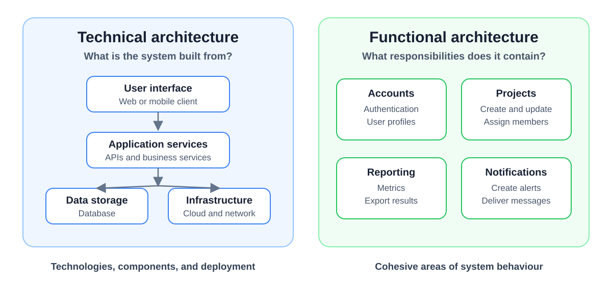

# Generative AI in Software Engineering: Student Survey Findings

**Date:** 2026-09-21  
**Week:** 2

## Lesson Summary

This lecture examines how students used generative AI tools during large software-engineering projects. The results show that these tools can accelerate development, but their value depends heavily on the task, the developer's expertise, and the quality of human verification.

- survey results across common software-development tasks;
- strengths and limitations of generative AI tools;
- the importance of context, architecture, and domain knowledge;
- testing, verification, and human responsibility;
- the effect of AI-assisted development on learning and expertise.

---

## Purpose of the Survey

The module has incorporated generative AI tools because they are increasingly used in industry. The objective is not simply to use the tools to finish the project, but to investigate where they help, where they fail, and how they change software-engineering practice.

Feedback was collected from successive student cohorts working on large group projects. The survey considered students from different programmes, educational backgrounds, and levels of professional experience. The reported results did not show a meaningful difference based only on whether a student had an undergraduate computer-science degree.

Tool choice was not prescribed because available models and coding agents change quickly. The more important question is how the tools are used.

## Survey Design

The survey considered four development tasks:

- writing test code;
- writing simple code;
- writing complex code;
- debugging.

For each task, students evaluated four aspects on a five-point scale:

1. how much time the tool saved;
2. how helpful the tool was;
3. how much editing the generated output required;
4. whether using the tool improved their programming skills.

The survey collected two kinds of feedback. Individual students answered the scaled questions and provided written comments, while each project group later produced a collective report covering its strengths, limitations, and lessons learned. This lecture discussed only the individual responses; the group reports were left for a later class.

## Where Generative AI Helps

The strongest results concerned repetitive, well-defined, and self-contained tasks. Generative AI was particularly useful for:

- generating boilerplate and simple code;
- scaffolding an implementation;
- exploring ideas and producing rapid prototypes;
- writing small, isolated tests;
- identifying straightforward compilation and runtime errors.

For these tasks, the tool can act as a collaborator, learning accelerator, and rapid experimentation aid. It reduces time spent on syntax and routine implementation work.

## Where It Struggles

Performance becomes less reliable when a task requires deep architectural reasoning, domain-specific logic, or an understanding of a large distributed system. Generated code may be locally plausible while conflicting with decisions made elsewhere in the project.

Complex tasks require the developer to communicate more context, including:

- the intended behaviour of the system;
- architectural decisions and constraints;
- dependencies and framework versions;
- interactions between components;
- relevant domain knowledge.

This creates a **context gap**. A tool may perform well on a small self-contained problem, but its output can degrade as the project becomes larger and more dependent on project-specific knowledge.

## Architecture and System Intent

A large project has both a **technical architecture** and a **functional architecture**:

- the technical architecture describes the technologies, infrastructure, and major system components;
- the functional architecture divides the system into cohesive responsibilities.

The lecture compared functional architecture to a house: activities related to cooking belong in the kitchen, while activities related to watching television belong in the sitting room. Software responsibilities should be divided just as deliberately.

Even when an agent can produce most of the code, humans must still determine what the system should do. Clear intent, requirements, constraints, and guardrails remain intellectual engineering work.

## Testing Is Not Automatic Proof

Generated tests may compile, run, and produce a green test suite while checking the wrong behaviour. Therefore, the important question is not only whether the tests pass, but whether they test the intended requirement.

AI tools tend to handle isolated compilation and runtime errors better than logical, behavioural, or system-level defects. These harder defects require knowledge of what the system is supposed to do and how its components should interact.

The lecture also described **test-driven development (TDD)** primarily as a design and specification technique. A test expresses the behaviour expected from the system; it is not merely a final check performed after implementation.

## Expertise Changes the Value of the Tool

Generative AI produced the greatest productivity gains when developers already had relevant expertise. Experienced developers were better able to:

- ask precise and useful questions;
- provide the necessary context;
- recognise incorrect or unsuitable output;
- integrate generated code into the existing system;
- use the tool strategically rather than accepting its first answer.

The more a developer knows, the easier it is to detect mistakes before they create additional debugging or integration work. Generative AI is therefore not a replacement for system understanding, engineering judgement, architectural thinking, careful testing, or ownership of the codebase.

## Learning Through Critical Use

AI-assisted development shifts some effort away from recalling syntax and writing low-level implementation code. It places greater emphasis on specifying, validating, integrating, and directing the system.

This shift can support learning when students actively interrogate the output. Useful practices include:

- asking **why** a solution works, not only how to obtain it;
- requesting explanations and checking them critically;
- correcting errors rather than immediately copying the output;
- explaining generated code to another team member.

Having to explain code exposes gaps in understanding. One possible team workflow is to perform the specification and definition of guardrails in human pairs, use a coding agent for implementation, and then require each partner to explain and review the result. Copying generated code without reflection provides much weaker educational value.

## Human Validation and Responsibility

Modern coding agents can perform longer and more autonomous tasks, making continuous line-by-line supervision increasingly difficult. This does not remove the need for verification; it changes the level at which verification may occur.

For example, engineers generally trust compilers without inspecting the generated machine code, but they still verify the higher-level program. Similarly, teams may need new ways to verify the behaviour of agent-produced systems without reading every generated line.

The required level of validation depends on the stakes. Safety-critical, physical, business-critical, and customer-facing systems require stronger evidence than low-risk prototypes. Regardless of the technique used, engineers must still be able to answer:

> How do you know that the system does what it is supposed to do?

Having another agent review the code may help, but it does not transfer responsibility away from the human team.

## Risks and Open Questions

The lecture identified an unresolved tension: AI can increase short-term productivity while weakening the process through which junior developers acquire expertise. If organisations stop developing entry-level engineers, they may later face a shortage of people capable of understanding and supervising complex systems.

The lecturer compared this risk to Ireland after the 2008 financial crisis: construction stopped, young workers emigrated, and the country later faced shortages of both skilled builders and housing. Similarly, failing to train junior developers today could produce a shortage of experienced software engineers in the future.

Access is another concern. Developers and organisations able to pay for more capable models may gain an increasing advantage over those using weaker tools.

The overall conclusion was neither that generative AI is entirely beneficial nor that it should be avoided. It is transformative and highly useful, but its effectiveness depends on critical use, suitable verification, and continued investment in human understanding.

## Implications for the Group Project

The project provides an opportunity to experiment with these questions in a large team and on a substantial system. Teams should be prepared to explain:

- how they use generative AI tools;
- which tasks the tools perform well or poorly;
- how they preserve architectural consistency;
- how they verify generated code and tests;
- what the team has learned from the process.

The following class will begin requirements engineering and use cases. Defining what the system should do is the first step towards providing agents—and the human team—with a clear specification.
