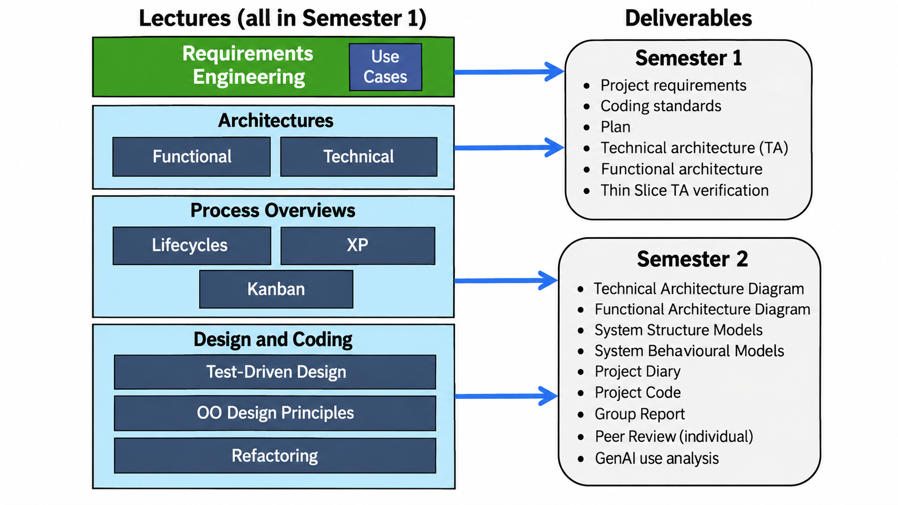
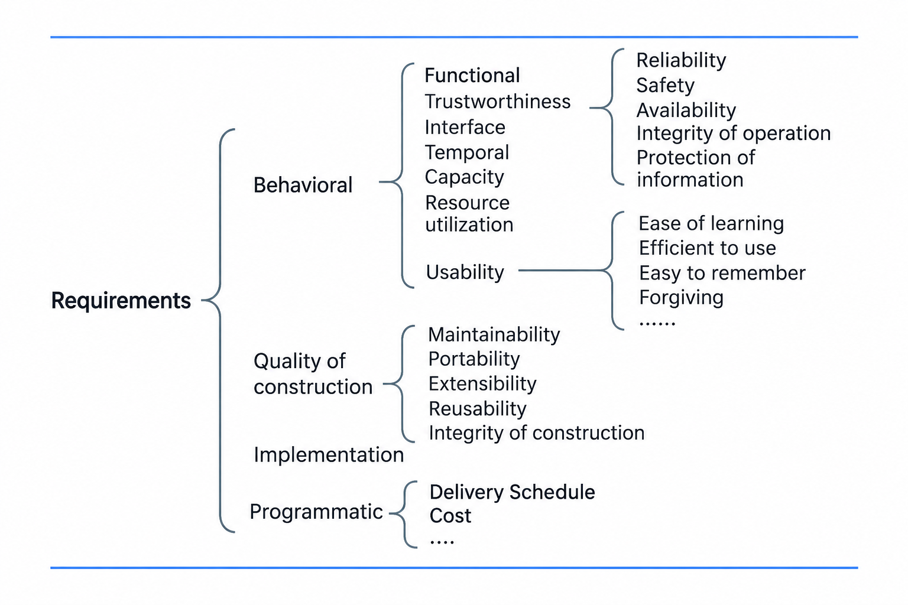
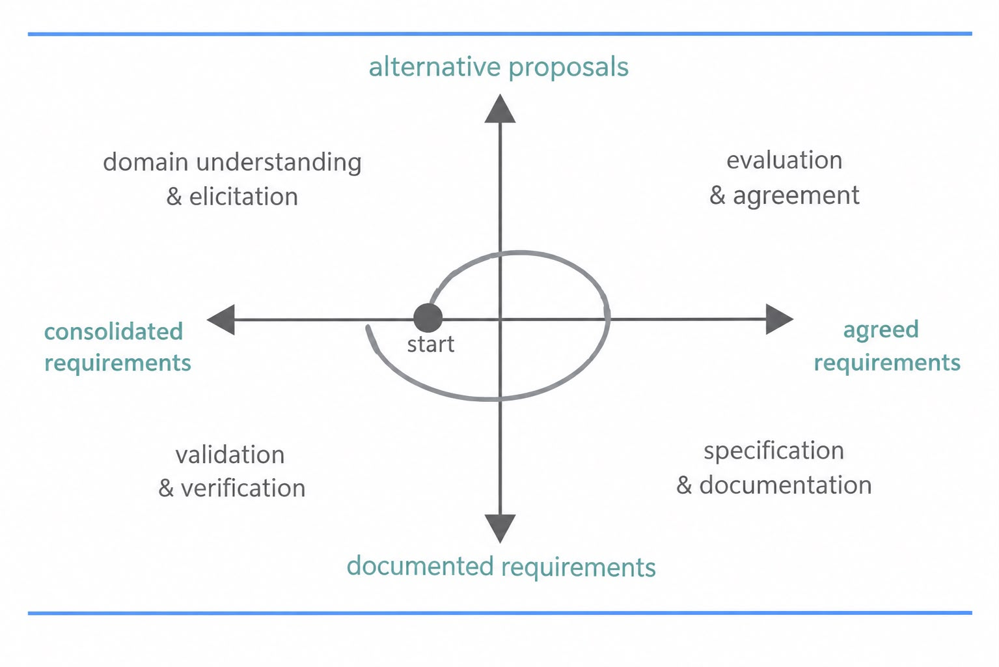
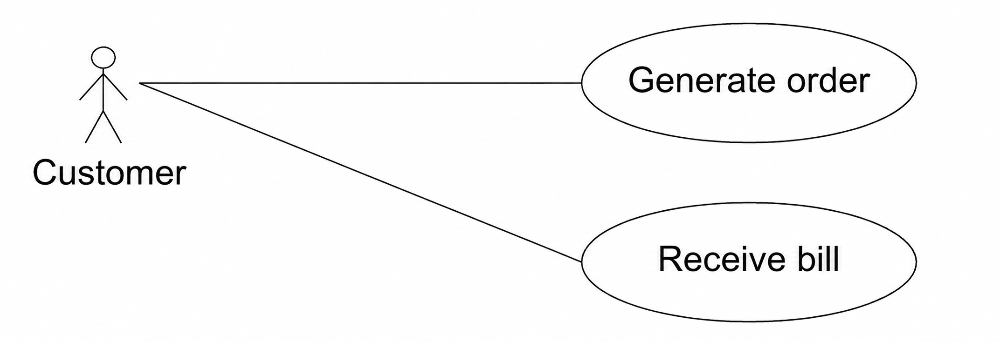
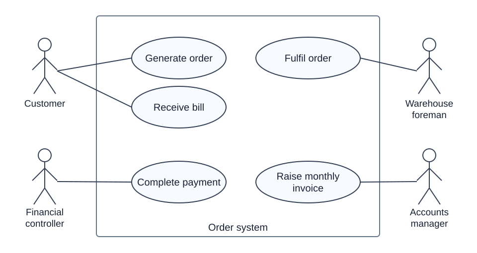
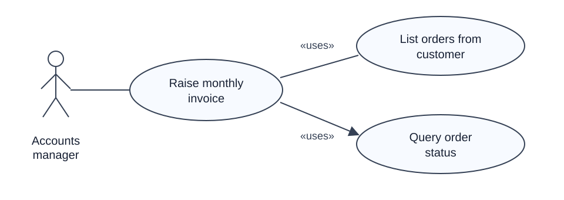

# GenAI and Requirements Engineering

**Date:** 2026-09-25  
**Week:** 2

---

## GenAI in Software Development

- AI works best as an assistant, not an oracle. Verification is essential.
- Prompt engineering and context management matter.
- AI changes team dynamics.
- GenAI is a force multiplier for competent developers, but it can amplify both good and bad engineering habits.
- The main bottleneck shifts from producing code to evaluating it. Traditionally, writing code was expensive; with GenAI, more time is spent validating, integrating, reviewing, and contextualising the output.
- Passing tests are not proof of correctness if the tests check the wrong behaviour. Developers must inspect what the tests specify and whether the implementation meets the intended requirement.
- GenAI can accelerate routine work, but developers remain responsible for understanding the system, making architectural decisions, and reviewing its output. The lecturer also stressed the value of working together in person rather than relying only on AI agents.

## Lecture Topics and Deliverables

For the first semester, the project deliverables include requirements expressed through use cases, coding standards, a plan, technical and functional architectures, and a thin slice that verifies the technical architecture. A thin slice exercises a small piece of functionality across the chosen technologies and system layers, so integration problems can be found before fuller implementation.

## Types of Requirements

- **Behavioural requirements** describe externally visible system behaviour and qualities. They include functions, interfaces, timing and throughput, capacity, resource use, trustworthiness (such as reliability, availability, safety, and information protection), and usability. The intended users and workload affect these requirements.
- **Quality of construction requirements** concern the software's internal qualities, such as maintainability, portability, extensibility, and reusability.
- **Implementation requirements** constrain how the system is built, for example by specifying technologies, components, processes, or design standards.
- **Programmatic requirements** concern the project and its delivery, including cost, schedule, and organisational constraints.

These requirements involve trade-offs: demanding greater capacity or continuous availability, for example, affects the architecture and cost.

## Requirements Engineering Process

Requirements engineering identifies, analyses, negotiates, documents, and validates what a system should do and the constraints under which it must operate. Its scale depends on the project: a small system with one knowledgeable client needs less negotiation than a large system with many users and existing systems.

The process is iterative:

1. **Domain understanding and elicitation:** Understand the current work and environment, identify stakeholders, and gather needs, constraints, assumptions, and possible scenarios. Stakeholders can include users, domain experts, clients, managers, and developers. Interviews, workshops, and observation may help reveal needs that are difficult to state directly.
2. **Evaluation and agreement:** Examine alternatives, priorities, and conflicts between stakeholders, then negotiate an agreed set of requirements. Cost and schedule may limit what can be delivered.
3. **Specification and documentation:** Record the agreed requirements clearly enough to guide design and implementation.
4. **Validation and verification:** Check the requirements for omissions, errors, and disagreement, then revise them as needed.

## Use Cases

A **use case** describes a way an **actor** interacts with the system to achieve a goal. It helps express the required behaviour from the user's perspective. 

For example, a word processor user might create a document, add text, insert an image, or change formatting. These actions suggest use cases that the system must support.

In a use case diagram, **actors** are roles outside the system boundary, while the use cases inside the boundary represent the system's user-visible functionality. The boundary makes clear which behaviour the proposed system must provide. Lines connect actors to the use cases they participate in; a diagram can show several actor roles and several use cases.

Use cases can also depend on one another. In the slide's **«uses»** notation, an arrow points from a use case to functionality it uses in another use case. These relationships can reveal reusable functionality and dependencies that matter for planning or early prototyping.

The **RUP use case template** provides more detail for each use case:

- name, system or subsystem, and primary actor;
- trigger, preconditions, and postconditions;
- main flow of actions when the interaction succeeds;
- alternative or exceptional flows when circumstances differ or something goes wrong.
