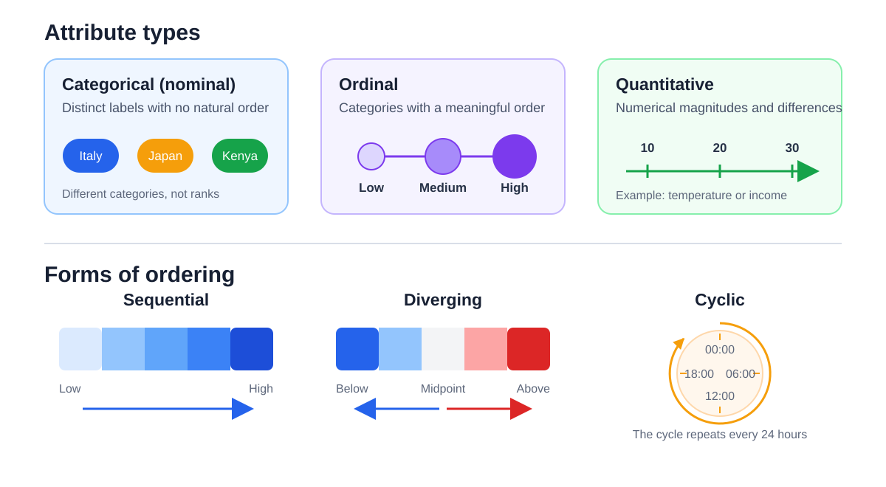

# Introduction – Part 2: Visualisation Concerns and Challenges

**Date:** 2026-09-18  
**Week:** 1

---

## Classifying the Data

Before choosing a visual representation, it is useful to identify the types of attributes in the data:

- **categorical (nominal):** labels with no natural order, such as country or blood type;
- **ordinal:** values with a meaningful order, such as low, medium, and high;
- **quantitative:** numerical values for which differences and magnitudes are meaningful.

An ordered attribute may be **sequential**, moving from low to high; **diverging**, extending in two directions from a meaningful midpoint; or **cyclic**, repeating after a complete cycle, as with time of day.

The dataset also has a structure. Common structures include **tables**, **networks and trees**, **continuous fields**, and **discrete geometry**. This structure constrains which visualisation techniques can be used.

## Start with the Task

The structure of the data limits which visualisations are possible, but it does not determine the best one. The first question should be: **what task must the visualisation support?** The same data may require different representations for different tasks.

For example, the same CT scan can be rendered to emphasise skin, bone, or internal tissue. Each view uses the same underlying data but supports a different diagnostic task.

A useful way to describe a task is as an **action-target pair**:

- the **action** describes what the user wants to do, such as search, browse, compare, or identify;
- the **target** describes what the action concerns, such as damaged tissue, an outlier, a trend, a distribution, a dependency, or an extreme value.

Complex problems may require one visualisation to support several tasks at once.

## Visual Encoding

Visualisation encodes data values using graphical properties that the viewer decodes. Common visual channels include:

- position;
- colour, luminance, and saturation;
- size and length;
- angle and orientation;
- shape, texture, and pattern;
- motion.

Position is generally the most precise channel because people are good at judging relative locations. Sorting related values, aligning marks to a common baseline, and placing similar items close together also make comparison and search easier.

The choice of channel must suit both the data type and the task. Two charts can show the same data but make different relationships easier to perceive.

## Managing Complex or Large Data

A display has limited space, so showing every value can produce clutter and make the visualisation harder to read. The goal is to balance **informativeness** with **readability**.

Visualisation idioms use three broad groups of operations:

- **reduction:** filtering irrelevant items, aggregating values, or partitioning data into smaller groups;
- **interaction:** transforming the viewpoint or representation, selecting items, or navigating through the data;
- **composition:** juxtaposing separate views, embedding one representation inside another, or superimposing multiple representations.

Interactive controls can let users change filters or views and check whether important information was hidden.

Each visual signal requires attention and therefore adds mental load. A design should communicate as much relevant information as possible while avoiding unnecessary graphical elements, processing, memory use, and power consumption.

## Exploratory and Explanatory Visualisation

**Exploratory visualisation** helps an analyst investigate data and discover patterns or conclusions that are not yet known. It may contain multiple views and interactive controls because the analyst needs to examine the data from different perspectives.

**Explanatory visualisation** communicates a known result to another audience. It is usually more selective and polished, guiding attention towards a particular finding or narrative.

**Data art** focuses more strongly on engaging, persuading, or creating an emotional response. It may prioritise aesthetics and impact over precise, objective analysis.

The intended audience affects the design. Expertise, familiarity with the chart type, available time, and the purpose of the presentation determine how much information and explanation should be included. A visually sophisticated representation is not automatically better: domain experts may prefer a familiar display that they can interpret reliably.

## Design and Evaluation

Data visualisation is both an analytical and a design activity. There may be several reasonable solutions, and effectiveness can be difficult to measure with a single metric. User studies can compare designs, but results obtained for one task or audience may not generalise to another.

The tool is only a means to an end. The designer should define the task and audience before choosing a chart type or software package.

Visualisation outputs range from one-off static images to reusable interactive systems. Simple standard charts may be produced with existing tools, while specialised tasks may require custom code or a domain-specific visualisation system.

## Processing

**Processing** is a Java-based programming environment designed for creating visual and interactive applications. It supports 2D and 3D graphics, animation, image processing, and user interaction, making it useful when standard charting tools are not flexible enough.

Processing is flexible and easy to experiment with, but standard charts often require more code than they would in a dedicated data-visualisation tool.
