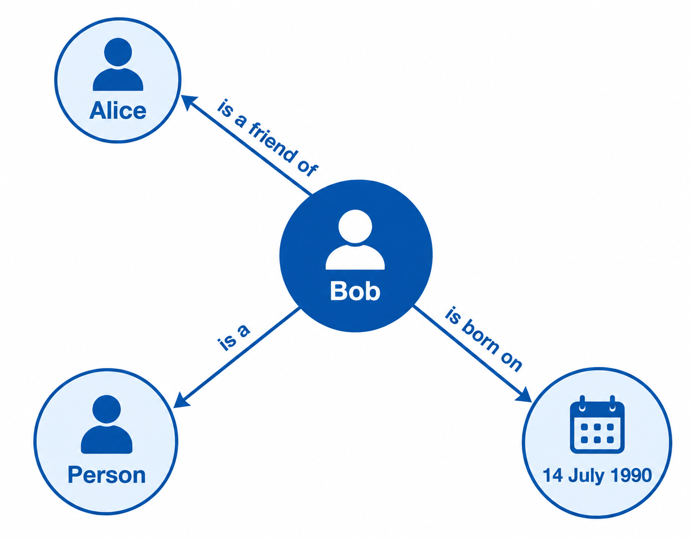
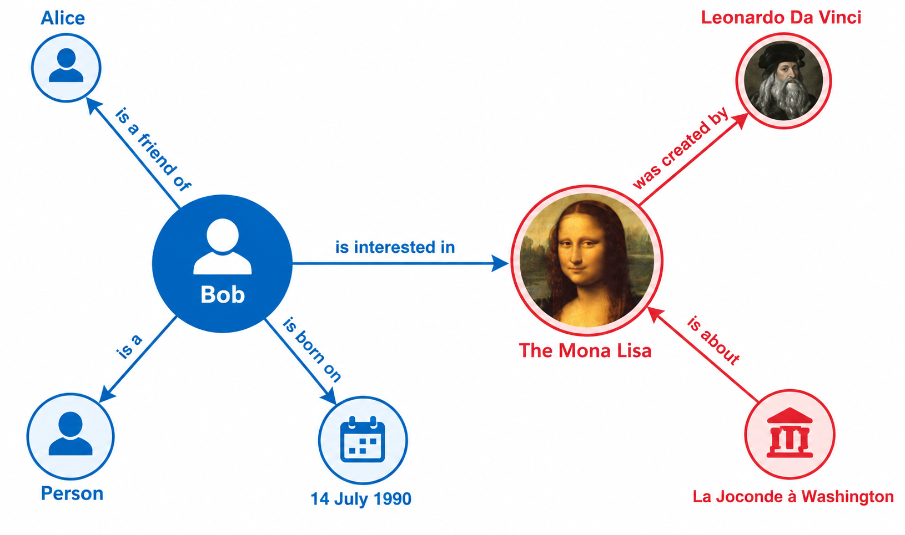
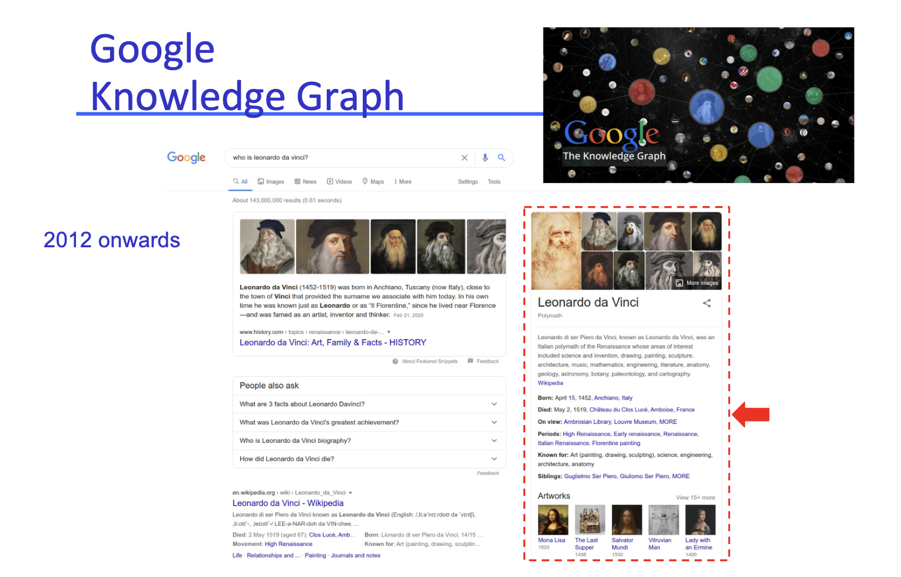
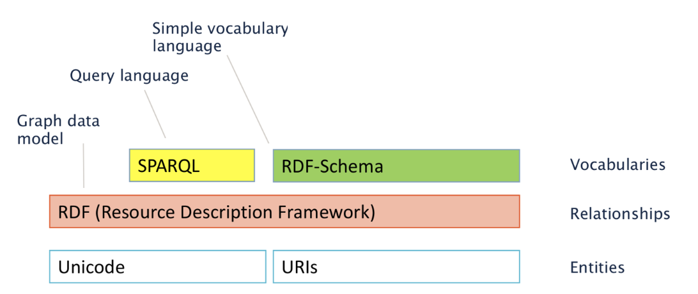
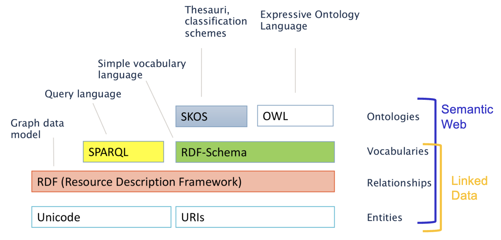

# Introduction

**Date:** 2026-09-14
**Week:** Week 1

## PDF Summary

This lecture introduces the challenges of managing and integrating diverse data at scale, and presents knowledge graphs as a flexible, standards-based approach to representing and connecting data. It establishes the W3C-based ecosystem that will be used throughout the module.

- Scale, uncertainty, dynamism, and changing data expressivity
- Interoperability challenges across data formats, platforms, and standards bodies
- Provenance, semantics, data quality, and data value
- Knowledge graphs and the advantages of graph-based representations
- RDF triples, Linked Data, and the Semantic Web

---

## Module Information

- There is no module demonstrator.
- Use The Clinic on Blackboard for module-related questions; do not email the lecturer directly about module topics.
- The lecturer will take attendance periodically.
- Lectures will not be recorded.
- Bring a laptop for access to materials and hands-on tasks.

## Reflection Task

Consider the properties of current data and data management that arise when building applications with database or knowledge-base technologies. [TODO: answer]

## Data Management Challenges

- **Scale:** increasing amounts of data must be integrated.
- **Uncertainty:** data may come from autonomous sources, be only partly curated, and use emergent schemas such as tags.
- **Dynamism:** sources can change, appear, or disappear at runtime.
- **Changing expressivity:** data ranges from relational structures to semi-structured or human-readable content, with varying guarantees and query styles.

**Personal observation:** Data protection, integrity, security, and privacy are also relevant concerns when managing data.

## Interoperability Problems

Data interoperability is difficult because of the diversity of:

- data formats;
- data platforms;
- standards bodies.

Key questions include:

- Which data can be trusted, and where did it come from? (**provenance**)
- What does the data mean? (**semantics**)
- What is the **quality** and **value** of the data?

The module investigates whether a **machine-readable network** of data can address these challenges.

## Organising Data into Knowledge

Information and knowledge can be represented in several ways:

- objects, using object-oriented analysis and design;
- clauses, as used in early AI and Lisp; [TODO: add an example]
- XML;
- sets of entities that support logical operations and classification;
- graphs, using graph theory and entity-attribute-value models;
- a combination of these approaches.

This module focuses on a W3C-based knowledge graph approach that combines graphs, XML, sets, and description logic.

## Knowledge Graphs

A **knowledge graph (KG)** is a graph of data intended to accumulate and convey knowledge about the real world. Its nodes represent entities of interest, and its edges represent relations between those entities.

Example:



Knowledge graphs can connect data created by different entities.



## Advantages of a Graph-Based Approach

- Graphs provide a concise and intuitive abstraction in which edges capture relationships between entities.
- A schema can be defined later, allowing the data and its scope to evolve more flexibly.
- Ontologies and rules may define and support reasoning about the semantics of labels used in a graph. An **ontology** is a formal shared model of a domain: it defines concepts, relationships, and constraints, such as that every `Artist` is a `Person`.
- Specialised graph query languages support:
  - relational operations (joins, unions, projections, etc.)
  - navigation operations for recursively finding entities connected through arbitrary-length paths
- Graph analytics can support centrality, clustering, and summarisation.
- Vector-based representations, including knowledge graph embeddings and GraphRAG, support machine learning over graphs.

Google Knowledge Graph was an early public-facing example of knowledge-graph technology.



## DBpedia and Wikidata

Both DBpedia and Wikidata are community-maintained RDF Linked Open Data resources with APIs.

- **DBpedia** automatically extracts structured data from Wikipedia infoboxes and uses manual and automated community quality checks.
- **Wikidata** is based on community curation of manually created and automatically generated data.

## Making Graphs Machine-Processable

Graphs can be represented as **triples**:

```text
subject - predicate - object
```

The subject and object are nodes, while the predicate is the edge that describes their relationship.

## W3C-Based Approach

The W3C stack builds knowledge graphs in layers: Unicode and URIs identify and encode entities; RDF models the graph and its relationships; RDF Schema supplies shared vocabularies; and SPARQL queries the resulting graph data. A **vocabulary** is a shared set of named terms used consistently to describe a domain, such as `Person`, `birthDate`, and `isFriendOf`.



The expanded stack shows how this foundation can be extended. **SKOS** supports thesauri and classification schemes, while **OWL** supports more expressive ontologies. It also distinguishes the Linked Data layer, which identifies entities and describes their relationships, from the broader Semantic Web layer, which adds ontologies.



**Linked Data** is a set of principles and best practices for publishing, interlinking, and using graph data with standard web technologies. It uses HTTP URIs to name resources and retrieve data through the existing HTTP stack.

The **Semantic Web** is the broader vision of a Web in which data and its relationships have explicit, machine-processable meaning. Technologies such as RDF, RDFS, OWL, and SPARQL support this vision.

The module focuses on W3C standards for knowledge graphs whenever possible.

## Representing Knowledge Beyond Simple Data

Knowledge graphs may contain:

- **simple statements**, such as “Dublin is the capital of Ireland”;
- **quantified statements**, such as “all capitals are cities”.

More expressive representations, such as ontologies or rules, are required for quantified statements. Deductive methods can derive additional knowledge, while inductive methods can extract implicit knowledge from data. [TODO: add an example]

## Assessment

- **20% group project:** build a W3C-based knowledge graph application using diverse open datasets. The project is issued in Week 3, with an interim presentation in Week 6, code and deliverables due at the end of Week 10, and demo sessions in Weeks 11 and 12.
- **80% individual in-person exam:** held during the end-of-semester examination session. The format will be similar to CS7IS1 exams from 2025, 2024, 2023, 2020, and earlier years. Past papers are available from the [Trinity annual past papers page](https://www.tcd.ie/academicregistry/exams/past-papers/annual/).

## Module Portfolio

Self-directed tasks reinforce lecture concepts, support the group project, and prepare students for practical exam questions. They are for personal development and do not need to be submitted on Blackboard.

See [Self-Directed Tasks](self-directed-tasks/self-directed-tasks.md) for the cumulative task recap.
