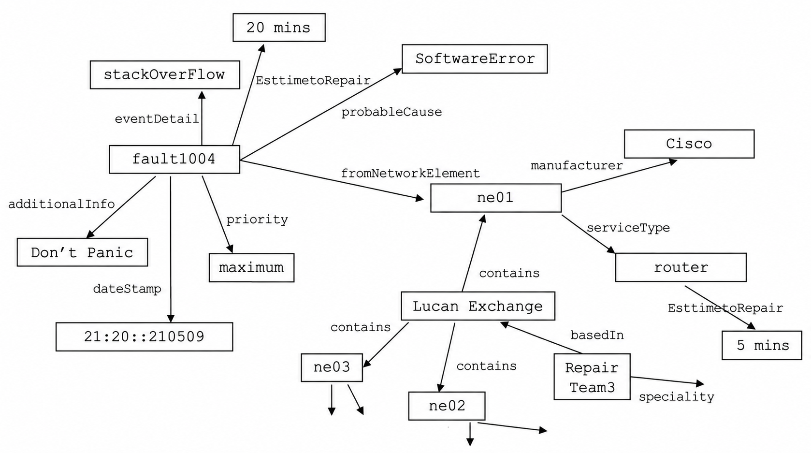
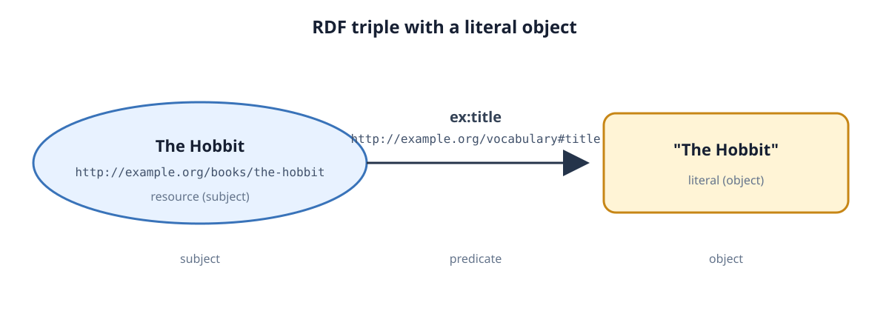
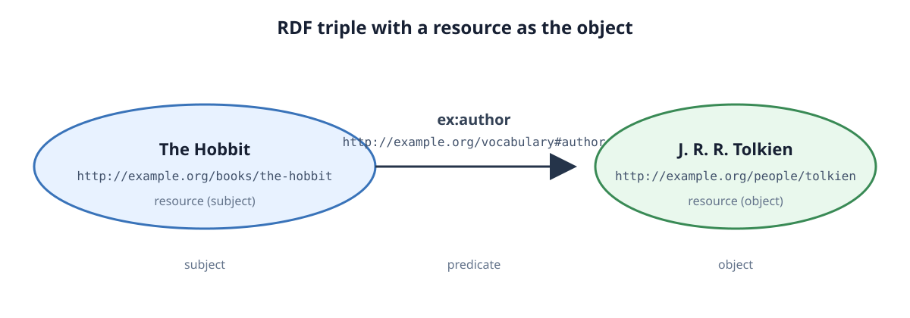
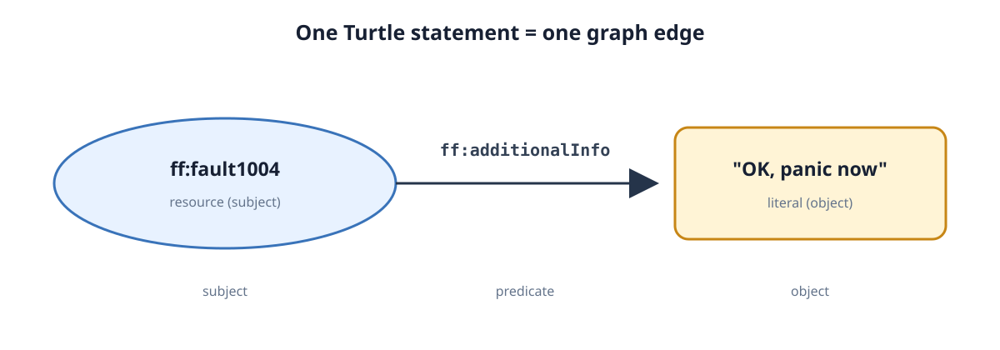
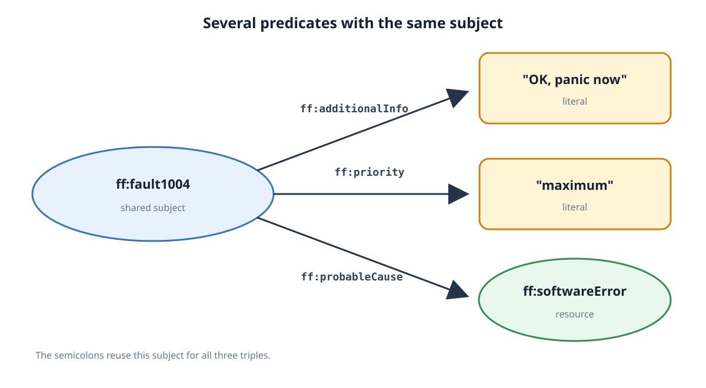
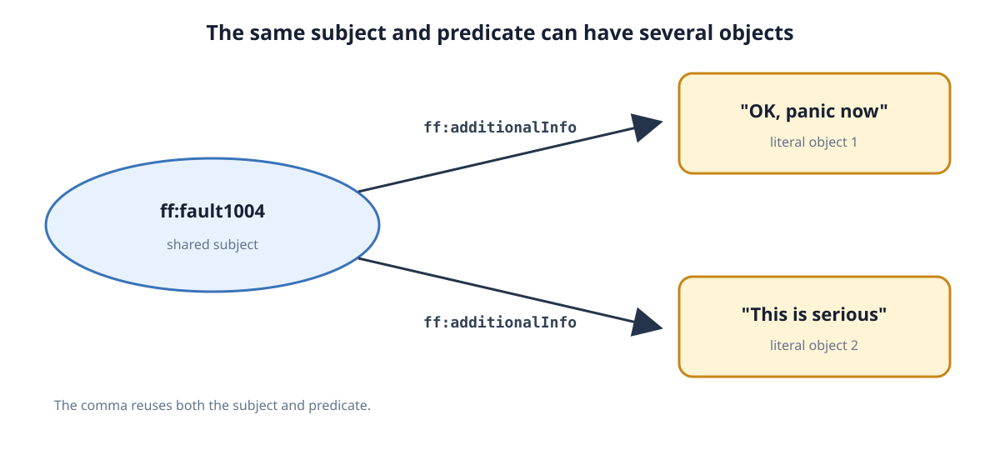
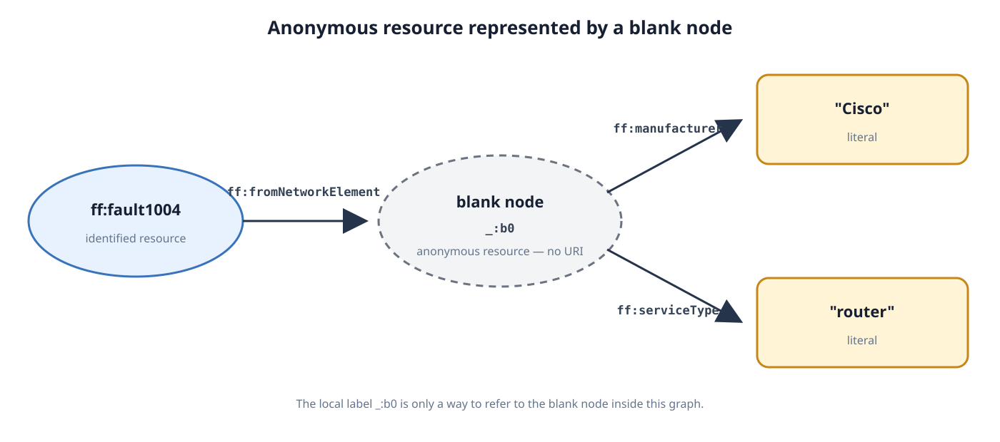
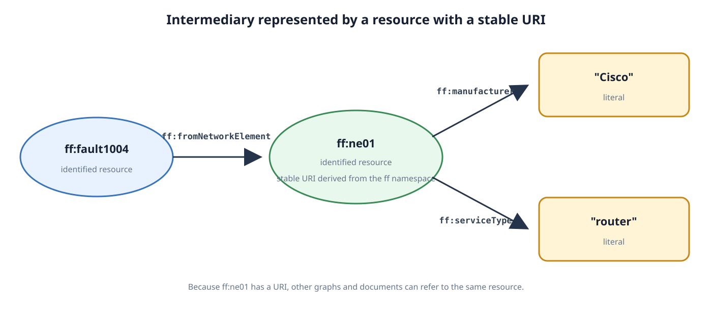

# Using Resource Description Framework (RDF)

**Date:** 2026-09-15
**Week:** 1

## Lesson Summary

This lecture introduces RDF as a W3C-standard model for representing data as a graph. It explains how URIs, namespaces, triples, and RDF serialisation formats make graph data identifiable, interoperable, and machine-processable on the Web.

- Graphs represented as nodes and arcs, or as subject–predicate–object triples
- RDF, its purpose, and its relationship with XML vocabularies
- URIs, URLs, URNs, and XML namespaces
- RDF/XML and Turtle serialisations
- RDF’s open world assumption and no unique name assumption
- Literals, predicates as first-class citizens, and blank nodes

---

## Resource Description Framework

The **Resource Description Framework (RDF)** is a model for describing data and resources. The word *framework* is important: RDF does not assume what kinds of things are being described. It can represent people, places, books, events, network faults, and many other types of resource.

RDF is:

- a W3C Recommendation;
- designed to be read and processed by computers;
- based on graphs and binary relationships;
- intended for describing resources on the Web;
- independent of any single concrete syntax.

RDF is a data model, not a file format. **RDF/XML**, **Turtle**, and **N3** are different serialisations of the same kind of RDF graph. In this module, RDF/XML and Turtle are introduced first, with Turtle used more often later because it is more readable.

## From Graphs to Triples

A graph consists of **nodes** connected by **arcs** (also called edges). Arcs represent predicates, properties, or relationships. For example, a graph might state that a fault has a probable cause and comes from a particular network element.

The same graph can be represented as triples:

```text
subject       predicate             object
fault1004     probableCause         SoftwareError
```

An RDF triple is a three-place relationship:

```text
subject - predicate - object
```

Each triple defines an edge. The subjects and objects provide the graph’s nodes, while the predicate names the relationship represented by that edge. A collection of triples forms an RDF graph.

> **Predicate**, **property**, and **relationship** are terms used for the arcs/edges connecting nodes.

### What the Example Graph Shows



The example graph illustrates several general properties of graphs and RDF:

- **Diversity:** one graph can represent different kinds of knowledge at the same time. In this example, it contains information about faults, network equipment, locations, repair teams, and literal values.
- **Agreement:** the meaning of predicates must be understood and shared. For example, users of the graph need to agree on what `probableCause`, `contains`, `manufacturer`, and `serviceType` mean. This can become difficult as the graph grows.
- **Structure:** for querying, it is necessary to know which nodes are connected by which predicates. Multi-hop paths such as `fault1004 → ne01 → Cisco` show how relationships form the graph’s structure.
- **Plurality:** the same relationship may appear several times. For example, `EsttimetoRepair` is used for both a fault and a router, with different literal values.
- **Asymmetry:** relationships are inherently directed. An arrow from `fault1004` to `SoftwareError` via `probableCause` does not automatically imply the reverse relationship.

## URIs and Resources

A **Uniform Resource Identifier (URI)** is a compact character sequence that identifies an abstract or physical resource. A URI can identify anything that needs to be described, including people, geographical locations, books, events, or concepts.

A URI has the following general syntax:

```text
scheme ":" ["//" authority] path ["?" query] ["#" fragment]
```

For example:

```text
foo://example.com:8042/over/there?name=ferret#nose
```

This contains a scheme, authority, path, query, and fragment. A URI scheme is not necessarily the same thing as a network protocol. An **IRI** (Internationalized Resource Identifier) is an internationalised version of a URI that supports a wider range of character encodings.

### Example URI Schemes

The scheme is the part before the first colon. Common examples include:

- `http:` for Web resources, for example `http://example.org/book`;
- `mailto:` for email addresses, for example `mailto:alice@example.org`;
- `tel:` for telephone numbers, for example `tel:+353123456789`;
- `telnet:` for resources accessible through Telnet, for example `telnet://example.org`.

### URI, URL, and URN

- A **URI** (Uniform Resource Identifier) identifies a resource.
- A **URL** (Uniform Resource Locator) is a type of URI that specifies where and how a resource can be retrieved.
- A **URN** (Uniform Resource Name) is a type of URI used as a persistent name; it does not imply that the resource is available for retrieval.

Therefore, every URL is a URI, but not every URI is a URL.

URL subset of URI
URN subset of URI

A particular URI can function both as a name and as a locator at the same time.

[TODO: aggiungere qualche esempio di URI, URL e URN]

## RDF’s Basic Structure

In RDF:

- the **subject** is a resource identified by a URI, or an anonymous resource represented by a blank node;
- the **predicate** is a resource identified by a URI;
- the **object** is either a resource (identified by a URI or blank node) or a literal value.

A literal is a value such as a string, number, or date. For example:

```text
http://example.org/fault1  http://example.org/hasPriority  "high"
```

The subject and predicate are resources, while `"high"` is a literal. If the object is another URI, the triple links two resources:

```text
http://example.org/fault1  http://example.org/probableCause  http://example.org/SoftwareError
```

## RDF’s Semantic Assumptions

### Open world assumption

Under the **open world assumption**, information that has not been stated is unknown. It must not be interpreted as false. This contrasts with the closed-world assumption commonly used in relational database reasoning, where missing information may be treated as false in a particular context.

### No unique name assumption

Different URIs are not automatically assumed to identify different things. Two resources with different URIs could still refer to the same real-world entity. Conversely, if two statements use the same URI, RDF treats them as referring to the same resource.

## XML Namespaces

A **vocabulary** is a set of named terms used to describe a domain, such as `Patient`, `Drug`, or `Name`.
Each XML vocabulary is considered to own a **namespace** in which its term names are unique.
A namespace is identified by a URI: this URI identifies the namespace associated with the vocabulary, not necessarily a document that can be retrieved on the Web.

```text
Vocabulary --owns--> Namespace --is identified by--> URI
```

A prefix is a short, local abbreviation for a namespace URI within one XML document. The XML notation `prefix:localName` identifies a vocabulary term. The prefix selects the namespace, while the local name identifies the term within that namespace.
The URI is supplied by the corresponding `xmlns` declaration. `xmlns` means *XML namespace*; it introduces the declaration rather than acting as the prefix itself.

For example:

```xml
<AccidentReport
    xmlns:sjh="http://hospital/sjh"
    xmlns:dub="http://airport/dub">
  <sjh:Patient>...</sjh:Patient>
  <dub:Drug>...</dub:Drug>
</AccidentReport>
```

In this example, `xmlns:dub="http://airport/dub"` associates the prefix `dub` with the namespace URI `http://airport/dub`. Therefore, `dub:Drug` is a concrete instance of `prefix:localName`: `dub` is the prefix and `Drug` is the local name. Its expanded XML name is `{http://airport/dub}Drug`.

Different vocabularies may use the same local name without ambiguity. For example, `sjh:Name` and `dub:Name` are distinct because their prefixes refer to different namespace URIs.

Some relevant namespaces are:

```text
rdf   http://www.w3.org/1999/02/22-rdf-syntax-ns#
rdfs  http://www.w3.org/2000/01/rdf-schema#
owl   http://www.w3.org/2002/07/owl#
xsd   http://www.w3.org/2001/XMLSchema#
foaf  http://xmlns.com/foaf/0.1/
```

## Predicates as First-Class Citizens

In RDF, a predicate has its own independent identity. For example, `estTimeToRepair` is not merely an anonymous attribute attached to an object; it is a resource that can itself be described and related to other resources.

This supports interoperability, but only if the meaning of terms is agreed upon and terms are used consistently. Definitions can be:

1. formally specified with a logical system such as a Semantic Web ontology;
2. distinguished unambiguously by using different URIs; or
3. made look-up-able through Web resources, as is common with Linked Data.

## RDF/XML

RDF/XML is an XML serialisation of RDF. RDF data is placed inside an element from the RDF namespace, and namespace declarations identify the vocabulary terms used in the document.

```xml
<?xml version="1.0"?>
<rdf:RDF
    xmlns:rdf="http://www.w3.org/1999/02/22-rdf-syntax-ns#"
    xmlns:ex="http://example.org/vocabulary#">
  <rdf:Description rdf:about="http://example.org/books/the-hobbit">
    <ex:title>The Hobbit</ex:title>
  </rdf:Description>
</rdf:RDF>
```

This says: “the resource identified by `http://example.org/books/the-hobbit` has the title `The Hobbit`.” It represents the following triple:

```text
<http://example.org/books/the-hobbit>
<http://example.org/vocabulary#title>
"The Hobbit"
```

- **Subject:** `rdf:about` supplies the URI of the book being described.
- **Predicate:** `ex:title` expands to `http://example.org/vocabulary#title` using the `xmlns:ex` declaration.
- **Object:** the text `The Hobbit` is a literal value.



### Example with a Resource as the Object

The object of a triple can also be another resource identified by a URI. The following example says: “the book *The Hobbit* has J. R. R. Tolkien as its author.”

```xml
<?xml version="1.0"?>
<rdf:RDF
    xmlns:rdf="http://www.w3.org/1999/02/22-rdf-syntax-ns#"
    xmlns:ex="http://example.org/vocabulary#">
  <rdf:Description rdf:about="http://example.org/books/the-hobbit">
    <ex:author rdf:resource="http://example.org/people/tolkien" />
  </rdf:Description>
</rdf:RDF>
```

This represents the following triple:

```text
<http://example.org/books/the-hobbit>
<http://example.org/vocabulary#author>
<http://example.org/people/tolkien>
```

- **Subject:** the URI of the book being described.
- **Predicate:** `ex:author`, expanded using the `xmlns:ex` declaration.
- **Object:** the URI of Tolkien, supplied by `rdf:resource`. Because it is a URI rather than text, the object is a resource and not a literal.



RDF/XML can coexist with other XML content, but its tree-shaped syntax is often less convenient for reading and writing RDF by hand.

## Turtle

**Turtle** (Terse RDF Triple Language) is a text-based, human-friendly RDF serialisation. It uses prefixes to abbreviate long URIs.

```turtle
@prefix ff: <http://example.org/fame-faults#> .

ff:fault1004 ff:additionalInfo "OK, panic now" .
```



The subject, predicate, and object are separated by whitespace, and a statement ends with a period. A semicolon allows several predicates to be written for the same subject:

```turtle
@prefix ff: <http://example.org/fame-faults#> .

ff:fault1004
    ff:additionalInfo "OK, panic now" ;
    ff:priority "maximum" ;
    ff:probableCause ff:softwareError .
```



A comma allows several objects for the same subject and predicate:

```turtle
ff:fault1004 ff:additionalInfo "OK, panic now", "This is serious" .
```



## Blank Nodes

Sometimes a structured value does not have an obvious identity and does not need a URI outside the current graph. RDF can represent it with a **blank node**. A blank node is an anonymous resource with local scope.

```turtle
@prefix ff: <http://example.org/fame-faults#> .

ff:fault1004
    ff:fromNetworkElement [
        ff:manufacturer "Cisco" ;
        ff:serviceType "router"
    ] .
```



The square brackets create a blank node and describe it inline. Blank nodes cannot be reliably referred to outside the graph in which they are defined. This can create complications when querying or merging graphs, so a URI is preferable when the resource needs a stable identity.

## Beyond Binary Relationships

RDF triples express binary relationships. If a relationship or an associated entity needs its own properties, it can be represented as a separate resource and linked to the original subject. For example, a fault can be linked to a network element, and that network element can then have its own manufacturer and service type:

```turtle
@prefix ff: <http://example.org/fame-faults#> .

ff:fault1004 ff:fromNetworkElement ff:ne01 .
ff:ne01
    ff:manufacturer "Cisco" ;
    ff:serviceType "router" .
```



## Handy Summary

| RDF term | URI resource | Blank node | Literal |
|---|---:|---:|---:|
| Subject | Yes | Yes | No |
| Predicate | Yes | No | No |
| Object | Yes | Yes | Yes |
