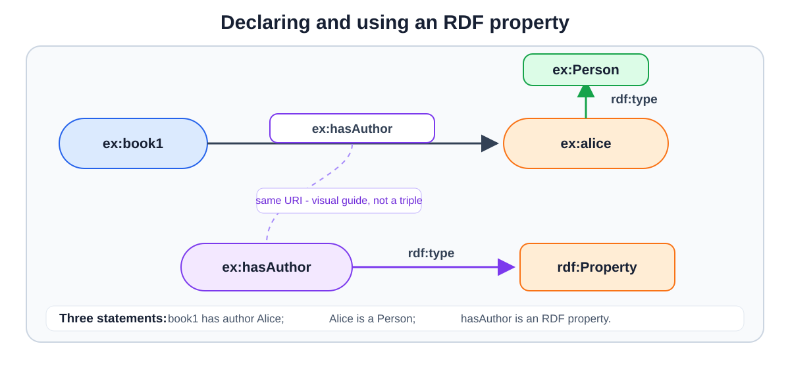
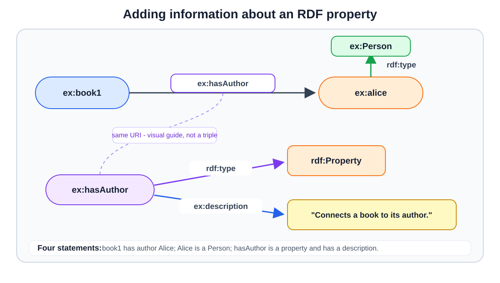
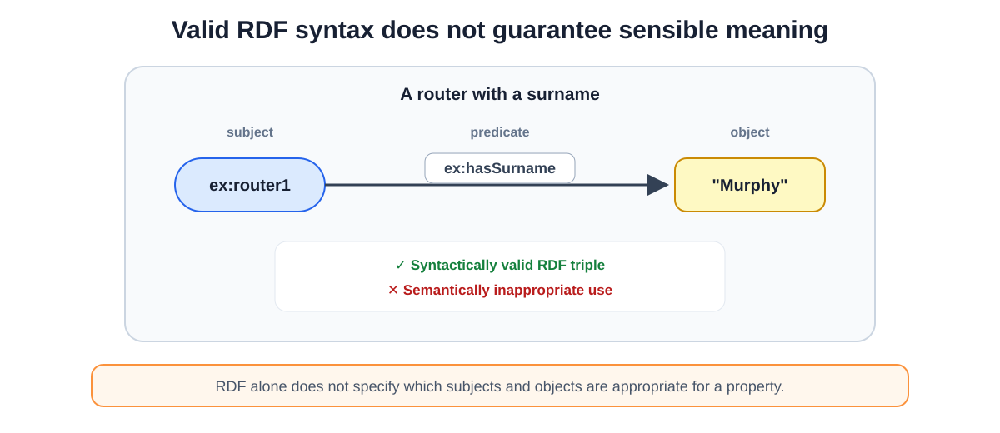
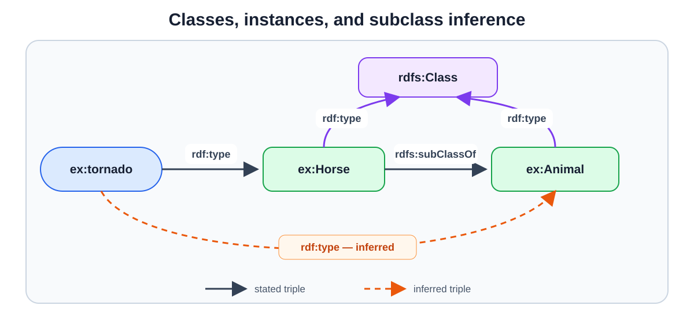
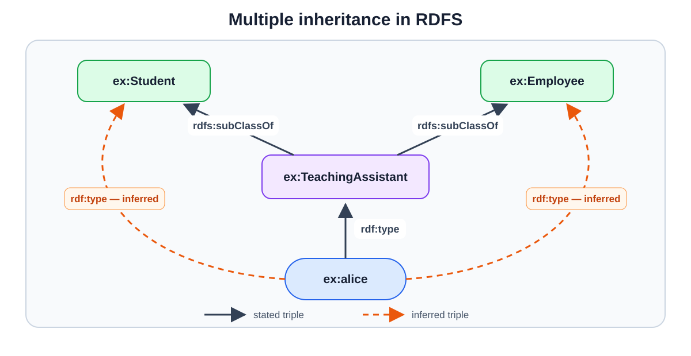
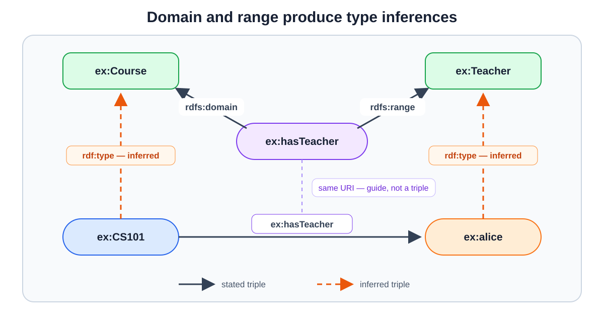
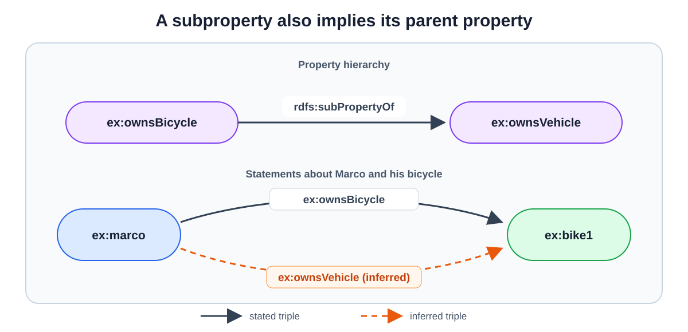
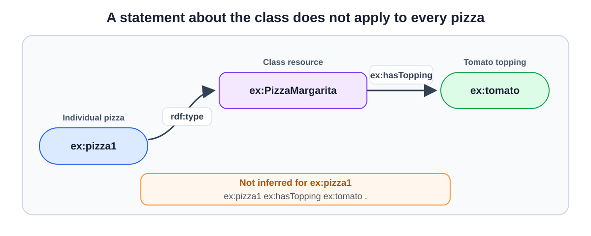

# RDFS - Resource Description Framework Schema

**Date:** 2026-09-21
**Week:** 2

## Lesson Summary

This lecture introduces RDF Schema (RDFS), a W3C vocabulary for adding basic structure and semantics to RDF graphs. RDFS makes it possible to define classes, class hierarchies, properties, domains, and ranges, and to derive implicit knowledge through simple entailment rules.

- RDF literals and weak typing;
- vocabularies, taxonomies, and ontologies;
- RDFS classes, instances, and subclass relationships;
- properties, domains, ranges, and subproperties;
- RDFS entailment and implicit knowledge;
- limitations of RDFS as an ontology language.

---

## RDF Recap: Literals and Types

A **literal** represents a value such as a string, number, or date. In an RDF triple, a literal can appear only as the object; subjects must be resources identified by a URI or represented by a blank node.

The lecture distinguishes two main forms of literal:

- A **plain literal** is a string with no explicitly stated datatype. It may optionally have a language tag:

  ```turtle
  "Christophe"
  "Christophe"@en
  ```

- A **typed literal** combines a lexical form with a datatype URI, usually from the XML Schema Definition (XSD) vocabulary:

  ```turtle
  "171"^^xsd:int
  "Christophe"^^xsd:string
  ```

  The datatype determines how the lexical form should be interpreted. Language tags are used with plain literals, not with typed literals.

### Common XSD Datatypes

The `xsd` prefix represents the namespace `http://www.w3.org/2001/XMLSchema#`. Some of the main RDF-compatible XSD datatypes are:

| Datatype | Typed literal example | Meaning |
| --- | --- | --- |
| `xsd:string` | `"hello"^^xsd:string` | Character string |
| `xsd:boolean` | `"true"^^xsd:boolean` | Boolean value: `true` or `false` |
| `xsd:integer` | `"42"^^xsd:integer` | Integer of arbitrary size |
| `xsd:int` | `"42"^^xsd:int` | Signed 32-bit integer |
| `xsd:decimal` | `"19.99"^^xsd:decimal` | Arbitrary-precision decimal number |
| `xsd:double` | `"4.2E9"^^xsd:double` | 64-bit floating-point number |
| `xsd:date` | `"2026-09-21"^^xsd:date` | Calendar date |
| `xsd:time` | `"14:30:00"^^xsd:time` | Time of day |
| `xsd:dateTime` | `"2026-09-21T14:30:00Z"^^xsd:dateTime` | Date and time, optionally with a timezone |

Turtle also provides shortcuts and assigns standard XSD datatypes to values written without quotation marks:

```turtle
"text"   # xsd:string
-5       # xsd:integer
-5.0     # xsd:decimal
4.2E9    # xsd:double
```

### Literal Term Equality

Two literals are the same RDF term only when their lexical forms, datatype URIs, and language tags are identical. Therefore:

```turtle
"1"^^xsd:integer
"01"^^xsd:integer
```

represent the same numerical value, but they are not the same RDF term because their lexical forms differ.

## Declaring Types and Properties in RDF

Even without RDFS, the RDF vocabulary provides a basic way to type resources and describe properties:

- `rdf:type` states that a resource is an instance of a type;
- `rdf:Property` identifies resources that represent relationships and can be used as predicates in RDF triples.

Consider these three triples:

```turtle
@prefix ex:  <http://example.org/ns#> .
@prefix rdf: <http://www.w3.org/1999/02/22-rdf-syntax-ns#> .

ex:hasAuthor rdf:type rdf:Property .
ex:alice rdf:type ex:Person .
ex:book1 ex:hasAuthor ex:alice .
```



The first triple explicitly declares `ex:hasAuthor` as a property. The third triple then uses it as a predicate to connect the book to its author:

```text
subject       predicate       object
ex:book1      ex:hasAuthor    ex:alice
```

However, the third triple would still be valid without the first one. Under RDF semantics, using `ex:hasAuthor` as a predicate is enough to infer that it is an `rdf:Property`. Therefore, the explicit declaration is optional:

```turtle
ex:hasAuthor rdf:type rdf:Property .
```

It records explicitly a fact that is already implicit when the property is used in the central position. This can still be useful when publishing a vocabulary separately, documenting its terms, or querying the vocabulary for all declared properties.

An RDF property is itself a resource, so it can also be the subject of other triples. This allows information to be attached to the property itself:

```turtle
ex:hasAuthor ex:description "Connects a book to its author." .
```



### Turtle Shorthand for `rdf:type`

The Turtle keyword `a` is shorthand for `rdf:type`:

```turtle
ex:alice a ex:Person .
ex:hasAuthor a rdf:Property .
```

## What the RDF Vocabulary Provides

For graph modelling, RDF is:

- **extensible:** new entities, predicates, and facts can be added easily;
- **standardised:** it is defined by the W3C;
- **scalable:** usable on the widest (Internet) scale;
- **identity-based:** URIs independently identify subjects, predicates, and resource objects;
- **typing:** RDF literals can use XSD datatypes to distinguish strings, numbers, dates, and other kinds of values.

> **Its main limitation is that typing beyond literals remains weak.** RDF can assert that something has a type or that a resource is a property, but it says little about how those types and properties are related or how they should be used.

## Why RDF Needs More Structure

RDF provides a way to build graphs from triples, but it imposes few structural constraints. In other words, it does not provide a strongly constrained schema. As a result, a triple can be syntactically valid even when its meaning is inappropriate: nothing prevents someone from assigning a surname to a network element or a tax number to an animal.



This weak typing creates two problems:

- **interpretation:** people and applications may use the same predicates with subtly different meanings or incompatible values;
- **scalability:** applications have little schema information with which to check or interpret large graphs consistently.

## Vocabularies, Taxonomies, and Ontologies

These concepts all define terms and relationships, but differ in expressiveness:

- a **vocabulary** is a collection of unambiguously defined terms used for communication;
- a **taxonomy** is a vocabulary whose terms are organised into one or more hierarchies (if all terms can only have one parent then it is a tree);
- an **ontology** defines concepts and relationships for a particular domain, including their meaning, interactions, and context of use.

Vocabularies and ontologies can be used to type the entities and relationships in a knowledge graph, support consistent graph construction, enable reasoning and checking, and make more sophisticated queries possible. **They can themselves be represented as RDF graphs** and may be embedded in the data graph or maintained separately.

## RDF Schema

**RDF Schema (RDFS)** is a W3C Recommendation and a semantic extension of RDF. It supplies a schema vocabulary for describing the terms used in an RDF graph.

Its principal terms include:

- `rdfs:Class` for classes;
- `rdf:type` for class membership;
- `rdfs:subClassOf` for class hierarchies;
- `rdf:Property` for properties;
- `rdfs:subPropertyOf` for property hierarchies;
- `rdfs:domain` and `rdfs:range` for typing the ends of a property.

Important built-in classes include `rdfs:Resource`, the class of all RDF resources; `rdfs:Literal`, the class of literal values; and `rdfs:Datatype`, the class of datatypes.

## Classes and Instances

A class is declared by making its URI an instance of `rdfs:Class`:

```turtle
@prefix ex:   <http://example.org/animals#> .
@prefix rdf:  <http://www.w3.org/1999/02/22-rdf-syntax-ns#> .
@prefix rdfs: <http://www.w3.org/2000/01/rdf-schema#> .

ex:Animal a rdfs:Class .
ex:Horse  a rdfs:Class ;
          rdfs:subClassOf ex:Animal .

ex:tornado a ex:Horse .
```

Using the `a` shorthand introduced above, the example states that `ex:tornado` is an instance of `ex:Horse`, while `ex:Horse` is a subclass of `ex:Animal`. An RDFS reasoner can therefore infer:

```turtle
ex:tornado a ex:Animal .
```



An **instance** is an individual member of a class. A **subclass** represents a subset of another class's members. The same concept may be modelled as an instance or as a class depending on the domain and the intended level of abstraction.

In the example, `ex:tornado` is an **instance** because it represents one particular horse. `ex:Horse` is a **subclass** of `ex:Animal` because every horse is also an animal.

RDFS also permits multiple inheritance: one class may be a subclass of more than one class.

For example, a teaching assistant may be both a student and an employee.



## Properties, Domain, and Range

A property is declared as an instance of `rdf:Property`:

```turtle
ex:hasTeacher a rdf:Property ;
    rdfs:domain ex:Course ;
    rdfs:range ex:Teacher .
```

- `rdfs:domain` states the class of resources that use the property as subjects;
- `rdfs:range` states the class of values used as objects.

These declarations are **inference rules, not validation constraints**. Given:

```turtle
ex:CS101 ex:hasTeacher ex:alice .
```

an RDFS reasoner can infer:

```turtle
ex:CS101 a ex:Course .
ex:alice a ex:Teacher .
```



If a property has several domain declarations, its subject is inferred to belong to all the declared classes. Multiple domains therefore express an intersection, not a choice between alternatives. The same principle applies to multiple ranges.

### Subproperties

`rdfs:subPropertyOf` defines a hierarchy between properties. If:

```turtle
ex:ownsBicycle rdfs:subPropertyOf ex:ownsVehicle .
ex:marco ex:ownsBicycle ex:bike1 .
```

then RDFS entails:

```turtle
ex:marco ex:ownsVehicle ex:bike1 .
```



## RDFS Annotation Properties

RDFS includes annotation properties for documenting resources:

- `rdfs:label` provides a human-readable name;
- `rdfs:comment` provides a human-readable description;
- `rdfs:seeAlso` points to related information;
- `rdfs:isDefinedBy` points to a resource's definition.

For example:

```turtle
ex:Person a rdfs:Class ;
    rdfs:label "Person"@en ;
    rdfs:comment "The class of people."@en .
```

## RDFS Entailment

**Entailment** derives implicit triples from explicitly stated triples and the semantics of RDFS. Important rules include:

- a property's domain determines the type of its subjects;
- a property's range determines the type of its objects;
- instances of a subclass are also instances of its superclass;
- triples using a subproperty also imply the corresponding superproperty triple;
- subclass and subproperty relationships are transitive.

For example:

```turtle
ex:Horse rdfs:subClassOf ex:Animal .
ex:tornado a ex:Horse .
```

entails:

```turtle
ex:tornado a ex:Animal .
```

The inferred triple does not need to be written explicitly. Applications may use an RDFS reasoner to materialise or otherwise account for this implicit knowledge.

## Pizza Example: What Can RDFS Express?

The slides ask whether each of these statements can be modelled in RDFS:

1. Every pizza is a meal.
2. Pizzas always have at least two toppings.
3. PizzaMargarita is a type of Pizza.
4. Every pizza from the class PizzaMargarita has a Tomato topping.
5. Everything having a topping is a pizza.
6. No pizza from the class PizzaMargarita has a topping from the class Meat.

### Discussion

**1. Yes — subclass.** Every instance of `ex:Pizza` is also an instance of `ex:Meal`:

```turtle
ex:Pizza rdfs:subClassOf ex:Meal .
```

**2. No — minimum cardinality.** RDFS cannot require every pizza to have at least two `ex:hasTopping` values.

**3. Yes, but “type” is ambiguous.** If `ex:PizzaMargarita` denotes one particular pizza, it is an instance. If it denotes a category of pizzas, it is a subclass:

```turtle
ex:PizzaMargarita a ex:Pizza .                    # One pizza
ex:PizzaMargarita rdfs:subClassOf ex:Pizza .       # A kind of pizza
```

In the first triple, `ex:PizzaMargarita` is an instance of `ex:Pizza`; in the second, it is a subclass. These are alternative answers to the slide's question. More generally, a class can itself be an instance of another class, so the two roles are not mutually exclusive.

Capitalisation is only a reading aid: class names often begin with an uppercase letter (`ex:Pizza`), while instance and property names often begin with a lowercase letter (`ex:pizza1`, `ex:hasTopping`). RDFS does not assign roles based on spelling; those come from the triples.

**4. No — a requirement for every member of a class.** Suppose `ex:tomato` denotes a tomato topping. These triples say that `ex:pizza1` is a Margherita pizza and attach `ex:tomato` to the *class resource* `ex:PizzaMargarita`:

```turtle
ex:pizza1 a ex:PizzaMargarita .
ex:PizzaMargarita ex:hasTopping ex:tomato .
```

RDFS does **not** pass `ex:hasTopping` from the class resource to its instances. It cannot infer `ex:pizza1 ex:hasTopping ex:tomato .` from those two triples. You could state that last triple explicitly for `ex:pizza1`, but it would still say nothing about other Margherita pizzas. RDFS has no way to require *every* instance of `ex:PizzaMargarita` to have a topping of type `ex:Tomato`.



**5. Yes, through domain inference.** If a resource has an `ex:hasTopping` value, RDFS can infer that the resource is a pizza:

```turtle
ex:hasTopping rdfs:domain ex:Pizza .
```

This infers a type; it does not reject a triple because its subject was not previously declared as a pizza.

**6. No — exclusion.** RDFS cannot forbid an instance of `ex:PizzaMargarita` from having a topping of type `ex:Meat`.

RDFS supports basic class relationships and type inference. Expressing requirements such as minimum counts, class-specific toppings, or exclusions needs a more expressive language, such as OWL.

## RDF and RDFS

RDF supplies the graph data model, URI-based identification, literals, `rdf:type`, and `rdf:Property`. RDFS adds classes, subclass and subproperty hierarchies, domain and range declarations, annotations, and limited inference.

Together, RDF and RDFS are sufficient to define simple vocabularies and publish linked data on the Web, but more expressive ontology languages are required for complex constraints and reasoning.
