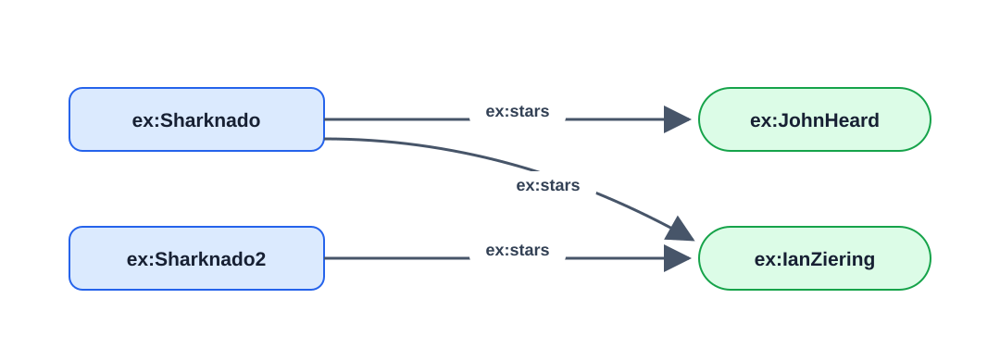
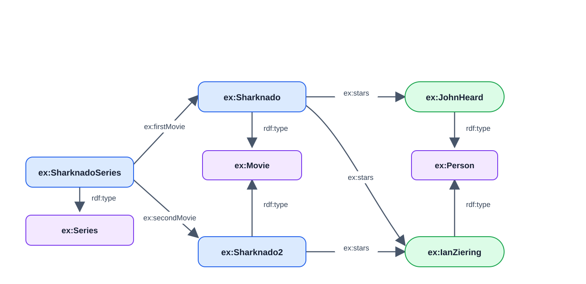
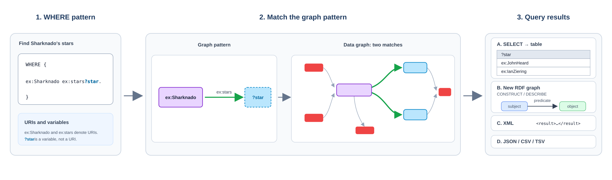

# SPARQL Part 1 – Fundamentals

**Date:** 2026-09-22  
**Week:** 2

## Lesson Summary

SPARQL is the query language for RDF graphs. This lecture introduces graph-pattern matching, the main query result forms, and the tools used to query RDF locally or through a web endpoint.

- Triple patterns, variables, and basic graph patterns.
- `SELECT` queries and the structure of a SPARQL query.
- `ASK`, `CONSTRUCT`, and `DESCRIBE` results.
- Duplicate solutions and result modifiers such as `DISTINCT`, `ORDER BY`, `LIMIT`, and `OFFSET`.
- RDF files, triplestores, and SPARQL endpoints.

---

## Why SPARQL?

RDF represents data as triples. **SPARQL** (SPARQL Protocol and RDF Query Language) retrieves information by matching patterns of triples against an RDF graph. Unlike a keyword search, it can follow relationships between resources. Because schemas are also RDF graphs, the same language can query both data and schema information, such as instances of a class or subclasses of another class.

## Triple Patterns and Variables

In SPARQL, a name beginning with `?` is a **variable**: `?star` can match different resources. A triple containing one or more variables is a **triple pattern**. The `WHERE` clause specifies the pattern to match; `SELECT` specifies which variable values to return.

Consider this simplified version of the lecture's *Sharknado* graph:

```turtle
@prefix ex: <http://ex.org/voc#> .

ex:Sharknado  ex:stars ex:JohnHeard .
ex:Sharknado  ex:stars ex:IanZiering .
ex:Sharknado2 ex:stars ex:IanZiering .
```



To ask who stars in *Sharknado*:

```sparql
PREFIX ex: <http://ex.org/voc#>

SELECT ?star
WHERE {
  ex:Sharknado ex:stars ?star .
}
```

The pattern matches two triples. It returns:

| `?star` |
| --- |
| `ex:JohnHeard` |
| `ex:IanZiering` |

The `?` marks `star` as a variable; each matching triple supplies one value for it.

## Basic Graph Patterns

A **basic graph pattern** is a set of triple patterns. All its patterns must match together. A variable repeated across patterns must have the same value in each one, connecting the matches.

The larger graph below adds the series, movie, and person types from the lecture slide. The query that follows matches the `ex:stars` relationships between the movies and their actors.



The lecture asks which other movies the stars of *Sharknado* appeared in:

```sparql
PREFIX ex: <http://ex.org/voc#>

SELECT ?star ?movie
WHERE {
  ex:Sharknado ex:stars ?star .
  ?movie ex:stars ?star .
}
```

The first pattern finds a star of *Sharknado*; the second finds movies featuring that same star. Against the small graph above, the solutions are:

| `?star` | `?movie` |
| --- | --- |
| `ex:JohnHeard` | `ex:Sharknado` |
| `ex:IanZiering` | `ex:Sharknado` |
| `ex:IanZiering` | `ex:Sharknado2` |

The query also returns *Sharknado* itself: neither pattern excludes the starting movie. Each complete match is a **solution**; `SELECT` returns only the variables named after it. `SELECT *` returns all variables in the pattern.

## Structure of a SPARQL Query

The slides present these parts in order:

1. `PREFIX` declarations abbreviate URI namespaces, as in Turtle.
2. A result clause, such as `SELECT`, says what form of answer to return.
3. An optional dataset clause, such as `FROM`, identifies the graph being queried.
4. `WHERE` contains the graph pattern to match.
5. Optional modifiers, such as `ORDER BY` and `LIMIT`, arrange or restrict the solutions.

The query engine matches the `WHERE` pattern against the graph, binds its variables for each match, and then builds the requested result. In a `SELECT` query, the selected variables become columns in a table.



For example, this query asks for the stars of *Sharknado*, sorts the results, and returns at most ten rows:

```sparql
PREFIX ex: <http://ex.org/voc#>           # 1. Prefix declarations

SELECT ?star                              # 2. Result clause
FROM <http://example.org/sharknado-graph> # 3. Dataset to query
WHERE {                                   # 4. Query pattern
  ex:Sharknado ex:stars ?star .
}
ORDER BY ?star                            # 5. Solution modifiers
LIMIT 10                                  # 5. Solution modifiers
```

The `FROM` URI is illustrative; replace it with the URI of the graph available in the endpoint or local store.

## Result Forms

SPARQL has four main query result forms:

| Form | Result |
| --- | --- |
| `SELECT` | A table of variable bindings. |
| `ASK` | `true` if the pattern has at least one solution; otherwise `false`. |
| `CONSTRUCT` | An RDF graph built from a template in the query and the matched solutions. |
| `DESCRIBE` | An RDF graph describing a resource; the exact triples returned depend on the query processor. |

This query returns `true` for the example graph:

```sparql
PREFIX ex: <http://ex.org/voc#>

ASK WHERE {
  ex:Sharknado ex:stars ex:JohnHeard .
}
```

Unlike `SELECT`, which returns rows, `CONSTRUCT` and `DESCRIBE` return RDF graphs.

`SELECT` results can be serialised in formats such as XML, JSON, CSV, or TSV.

## Duplicate Results and Solution Modifiers

SPARQL `SELECT` uses **bag semantics** by default: duplicate result rows can appear. In the two-pattern example, changing the result clause to `SELECT ?movie` would return `ex:Sharknado` twice, once through each star. `SELECT DISTINCT ?movie` keeps only one copy of each movie.

Other modifiers include:

- `ORDER BY ?movie` sorts results in ascending order by default; `ORDER BY DESC(?movie)` reverses the order.
- `LIMIT 20` returns at most 20 rows.
- `OFFSET 10` skips the first 10 rows. Together with `LIMIT 20`, it returns up to the next 20 rows; use `ORDER BY` when paging through results.

The slide describes `OFFSET 10` as starting “from the 10th result”; more precisely, it skips ten results and starts with the **11th**.

## Storing and Querying RDF

RDF can be kept in ordinary files, such as RDF/XML files. A SPARQL library or engine can query them, but indexing and management are left to the application; reasoning may require separate software.

A **triplestore** is a database designed to store and query RDF triples. Some triplestores are built specifically for RDF (**native**), while others add RDF support on top of a relational database (**RDBMS-backed**). A triplestore commonly provides indexing, a query engine, and an API; additional capabilities depend on the implementation and configuration.

## SPARQL Endpoints

An application can query a local SPARQL engine or send a query to a remote **SPARQL endpoint**, which exposes an RDF dataset through a web service. The lecture demonstrates this with YasGUI as a query interface and DBpedia as a public dataset. Returned resource URIs can be opened to explore linked data. Public endpoints commonly allow queries but not changes to their data; the slides recommend GraphDB Free for local practice.

For example, the lecture's DBpedia exercise looks for triples whose object is the English-tagged literal `"Elvis"@en`:

```sparql
SELECT DISTINCT ?s ?p
WHERE {
  ?s ?p "Elvis"@en .
}
LIMIT 50
```

Here `?s` and `?p` match the subject and predicate. The language tag matters: the pattern asks for the English-tagged literal, not an untagged string.
