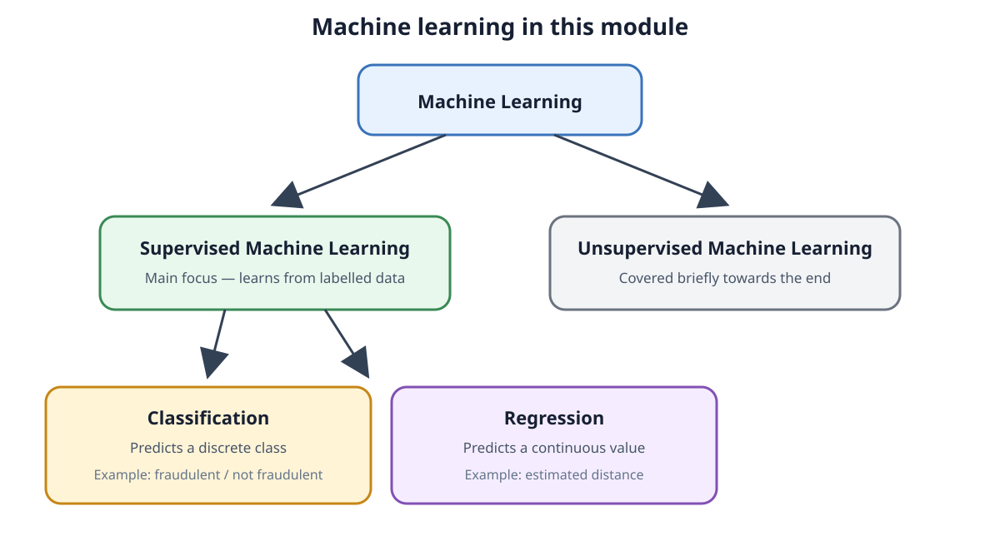
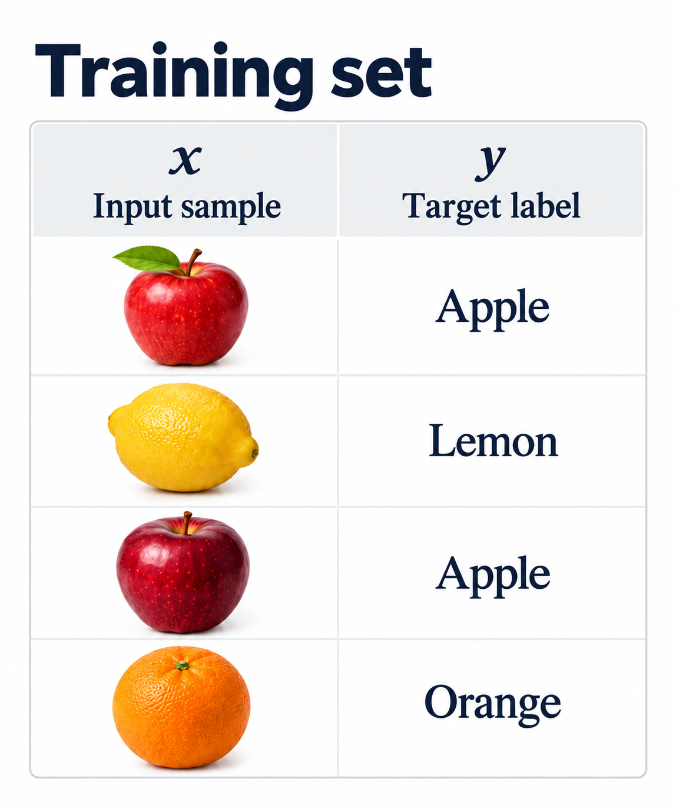
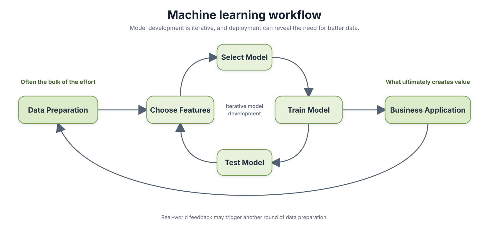
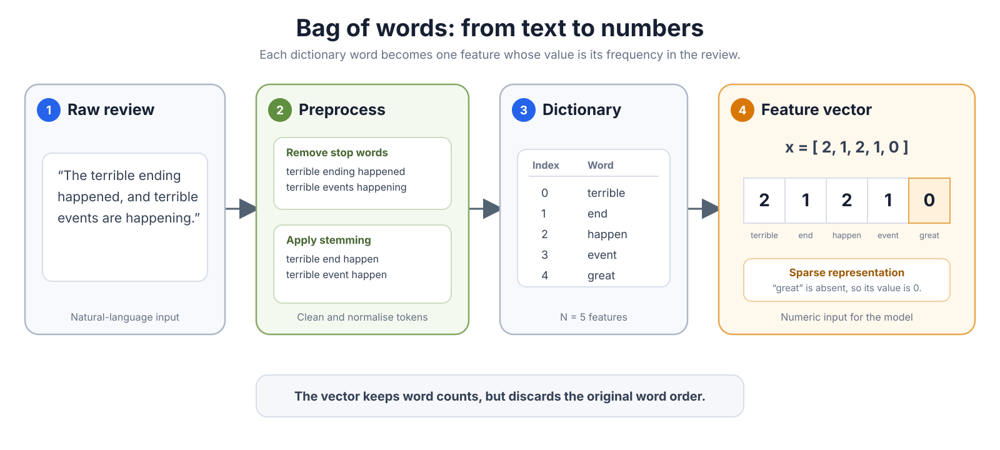

# Introduction to Machine Learning

**Date:** 2026-09-15
**Week:** 1

## PDF Summary

This lecture introduces the module and the basic supervised machine learning workflow. It uses movie-review sentiment analysis to show how raw data is converted into numerical features, processed by a predictive model, and evaluated.

- Module structure, assessment, prerequisites, and honour code
- Supervised learning, classification, and regression
- Training data sources and common data-quality problems
- Feature engineering through a bag-of-words representation
- Linear models, Naive Bayes, optimisation, and performance evaluation
- A practical sentiment-classification example using Python and scikit-learn

---

## Module Administration

- **Lecturer:** [Doug Leith](https://www.scss.tcd.ie/doug.leith/)
- The module uses Python and the scikit-learn (`sklearn`) package.
- Python programming is a prerequisite.
- **Assessment:** weekly assignments are worth 40%, and the final assignment is worth 60%.

Suggested online resources from the lecture:

- [Applied Machine Learning in Python](https://www.coursera.org/learn/python-machine-learning)
- [Neural Networks and Deep Learning](https://www.coursera.org/learn/neural-networks-deep-learning)

## Honour Code

For weekly assignments:

- write answers independently and in their own words;
- write their own code and not share it with others;
- not use ChatGPT to write answers or code;
- explain and justify how each answer was obtained;
- explain what submitted code does;
- interpret numerical results and plots rather than presenting them without discussion.

Simply referring to code or providing unexplained numbers or plots will receive a low mark.

The final assignment is entirely individual. Students must not discuss it with others and must write all answers and code themselves without using ChatGPT. Submissions are checked with anti-plagiarism software, and a random sample is also checked manually each week.

## Machine Learning

- **Supervised machine learning:** the main focus of the module.
- **Unsupervised machine learning:** covered briefly towards the end of the module.

The aim of supervised learning is to predict an output, also called a **target value**, using labelled data.

Two important supervised-learning tasks are:

- **Classification:** predicts one of a set of discrete classes. For example, a credit-card transaction may be classified as `fraudulent` or `not fraudulent`.
- **Regression:** predicts a continuous numerical value. For example, Bluetooth signal strength might be used to estimate the distance between two people.



## Classification Example

A classifier learns from a labelled **training set** and then predicts a label for a new input.

- The input \(x\) is represented as a numeric vector called a **feature vector**. For an image, its elements might be derived from pixel values.
- The output \(y\) is encoded numerically, such as `1` for an apple and `2` for an orange.
- The classifier is a function \(h\) that maps an input \(x\) to a predicted output \(\hat{y}\):

$$
\hat{y} = h(x)
$$

Building a classifier therefore requires two main steps:

1. map the real input, such as an image or text, to a numeric feature vector \(x\);
2. learn the prediction function \(h(x)\) from labelled data.



## Training Data

Supervised learning requires labelled examples. For fruit classification, the data might consist of fruit images together with labels such as `apple` or `orange`.

Raw data is often easier to collect than reliable labels. Labels may be obtained by:

- asking people to label data directly, including through services such as Amazon Mechanical Turk or CAPTCHAs;
- reusing previous human work, such as Wikipedia classifications or keywords assigned to academic papers;
- logging outcomes in an online service, such as whether a transaction flagged as suspicious is later confirmed as fraudulent.

Human labelling can be repetitive, error-prone, and poorly paid. Logged outcomes can also be indirect: for example, an advertisement click is easier to observe than whether the advertisement eventually caused a purchase.

### What Can Go Wrong?

- **Unrepresentative data:** the sample may cover only a narrow population, or historical data may no longer reflect current conditions.
- **Noisy or unreliable labels:** an observed event may be only weakly related to the outcome of interest.
- **Missing relationships:** the collected data may not capture the useful factors needed for prediction.
- **Correlation vs causation:** a statistical association does not by itself establish that one variable caused another.


This real dataset has a Pearson correlation of approximately `r = 0.985`, but the similar trends do not establish a causal relationship. The values are published in [PLOS ONE, Table 1](https://doi.org/10.1371/journal.pone.0326090.t001); the original data sources are identified as the U.S. Census Bureau and the National Science Foundation, as also reported in [Stanford CS109 course material](https://web.stanford.edu/class/archive/cs/cs109/cs109.1208/lectures/13_joint_statistics.pdf).

## Machine Learning Workflow

A typical workflow contains the following stages:

```text
Data preparation
    → choose features
    → select and train a model
    → test the model
    → use it in a business application
```



Model selection, training, and testing may be repeated iteratively. The lecture emphasises that data preparation often requires most of the effort, while the value of the system ultimately depends on its real-world application.

## Example: Movie Review Sentiment Analysis

The example task uses labelled [IMDb movie reviews](http://www.cs.cornell.edu/people/pabo/movie-review-data/). Given the text of a review, the model must predict whether its sentiment is positive or negative.

The training data contains reviews that have already been labelled as positive or negative. A simple starting idea is:

1. identify words associated with positive sentiment, such as `wonderful` or `great`;
2. identify words associated with negative sentiment, such as `terrible` or `awful`;
3. predict the class based on the words appearing in a review.

The labelled examples can be used to learn which words tend to be associated with each class.

## Bag of Words

[Arrivato qui]

A **bag-of-words** representation converts text into a numeric feature vector:

1. remove uninformative **stop words**, such as `and`, `of`, and `the`;
2. apply **stemming** to reduce related forms to a common stem, such as `happening`, `happened`, and `happens` to `happen`;
3. collect the resulting tokens into a dictionary containing \(N\) words;
4. map each review to a vector \(x\) of length \(N\), where \(x_i\) records how many times dictionary word \(i\) occurs.

For example, if `terrible` occurs twice in a review, the entry corresponding to `terrible` has value `2`. Words that do not occur have value `0`, so the resulting vectors are usually sparse.

This conversion from raw text to numerical values is an example of **feature engineering**.



## Linear Algebra Notation

Before defining the model, it is useful to introduce the required linear-algebra notation:

- A **scalar** is a single number.
- A **vector** is an ordered list of values. Vectors are treated as columns by default, for example:

$$
x =
\begin{bmatrix}
230.1 \\
37.8
\end{bmatrix}
= [230.1,37.8]^T.
$$

- The superscript \(T\) means **transpose**, not exponentiation. It changes the column vector \(x\) into the row vector \(x^T = [230.1,37.8]\).
- The **inner product**, also called the **dot product**, multiplies corresponding elements of two vectors and adds the results:

$$
x^T y = \sum_{i=1}^{n}x_i y_i.
$$

  The result of an inner product is a scalar.
- A **matrix** is a rectangular array of values, for example:

$$
A =
\begin{bmatrix}
1 & 2 \\
3 & 4
\end{bmatrix}
$$

- \(A_{11}\) denotes the value in row 1, column 1.

Revision resources mentioned in the lecture include the [Coursera matrices and vectors lesson](https://www.coursera.org/lecture/machine-learning/matrices-and-vectors-38jIT) and [Khan Academy Linear Algebra](https://www.khanacademy.org/math/linear-algebra).

## Linear Model

Assume that the dictionary contains \(N\) words. A review is represented by the feature vector

$$
x = [x_1, x_2, \ldots, x_N]^T,
$$

where \(x_i\) is the number of times dictionary word \(i\) occurs in the review. The model assigns one **weight** to each dictionary word:

$$
\theta = [\theta_1, \theta_2, \ldots, \theta_N]^T.
$$

The weights \(\theta\) are the model's learned parameters:

- a positive \(\theta_i\) makes the review more likely to be classified as positive;
- a negative \(\theta_i\) makes it more likely to be classified as negative;
- the magnitude \(|\theta_i|\) indicates how strongly word \(i\) affects the prediction.

The model calculates a scalar score \(z\) by multiplying each word count by its weight and adding the results. Using the inner-product notation defined above:

$$
z = \theta_1x_1 + \theta_2x_2 + \cdots + \theta_Nx_N
  = \sum_{i=1}^{N}\theta_ix_i
  = \theta^T x.
$$

Encode a positive review as \(+1\) and a negative review as \(-1\). The predicted label is

$$
\hat{y} = \operatorname{sign}(\theta^T x) = \operatorname{sign}(z),
$$

where the **sign function** keeps only the sign of the score:

$$
\operatorname{sign}(z) =
\begin{cases}
+1 & \text{if } z > 0, \\
0  & \text{if } z = 0, \\
-1 & \text{if } z < 0.
\end{cases}
$$

Thus, a positive score predicts positive sentiment, a negative score predicts negative sentiment, and a zero score represents a tie. A practical binary classifier must choose how to break this tie.

### Worked Example

Use the dictionary and feature vector from the previous bag-of-words example:

$$
\text{dictionary} = [\text{terrible},\text{end},\text{happen},\text{event},\text{great}]
$$

$$
x = [2,1,2,1,0]^T.
$$

Suppose the model has learned the weights

$$
\theta = [-2,-0.2,0,0,2.5]^T.
$$

The score is

$$
\begin{aligned}
z = \theta^T x
  &= (-2)(2) + (-0.2)(1) + (0)(2) + (0)(1) + (2.5)(0) \\
  &= -4.2.
\end{aligned}
$$

Therefore,

$$
\hat{y} = \operatorname{sign}(-4.2) = -1,
$$

so the model predicts **negative sentiment**. Notice that `great` has a strongly positive weight, but it contributes nothing because it does not occur in the review, so its feature value is \(0\).

The model is called **linear** because \(z\) is a weighted sum of the input features. Training the model means learning suitable values for the weights \(\theta\) from labelled reviews rather than choosing them manually.

## Training the Model: Naive Bayes

The model still needs values for the weights \(\theta\). One approach uses how frequently each word occurs in positive and negative reviews:

$$
f_{pos,j} =
\frac{\text{count of word }j\text{ in positive reviews}}
     {\text{total word count in positive reviews}}
$$

$$
f_{neg,j} =
\frac{\text{count of word }j\text{ in negative reviews}}
     {\text{total word count in negative reviews}}
$$

A first choice for the weight of word \(j\) is the ratio

$$
\theta_j = \frac{f_{pos,j}}{f_{neg,j}}.
$$

Its interpretation is straightforward:

- \(\theta_j > 1\): word \(j\) is more frequent in positive reviews;
- \(\theta_j < 1\): word \(j\) is more frequent in negative reviews;
- \(\theta_j = 1\): word \(j\) occurs equally often in both classes.

The slide then takes the logarithm so that large differences between ratios do not dominate the prediction:

$$
\theta_j = \log\left(\frac{f_{pos,j}}{f_{neg,j}}\right).
$$

It also adds an intercept based on the numbers of positive and negative reviews:

$$
\theta_0 = \log\left(
\frac{\text{number of positive reviews}}
     {\text{number of negative reviews}}
\right).
$$

The resulting score is

$$
z = \theta_0 + \sum_{j=1}^{N}\theta_jx_j.
$$

### Short Example

Suppose `terrible` has frequencies \(f_{pos}=0.01\) and \(f_{neg}=0.05\). Its initial ratio is

$$
\frac{0.01}{0.05}=0.2,
$$

which indicates that the word is more frequent in negative reviews. After taking the logarithm, its weight becomes

$$
\theta_{\text{terrible}}=\log(0.2)\approx -1.61.
$$

If the positive and negative classes contain the same number of reviews, then \(\theta_0=\log(1)=0\). When `terrible` occurs twice, it contributes

$$
(-1.61)(2)=-3.22
$$

to the score, pushing the prediction towards **negative sentiment**.

This Naive Bayes predictor achieved 99.4% accuracy on the movie-review training data in the lecture example. The unusually high training accuracy raises the question of whether the model will perform equally well on unseen data. Naive Bayes is often used as a baseline against which other models are compared.

## Training the Model: Optimisation

Another approach selects \(\theta\) to make predictions on the training data as accurate as possible. This requires:

- a **cost function** that measures prediction errors;
- an **optimisation algorithm** that adjusts the weights to minimise that cost.

Using a logistic-regression cost function produced 100% accuracy on the training data in the example. However, training accuracy alone is not a reliable test of prediction performance: evaluation should use data that was not used to fit the model.

## Key Ideas

- **Feature engineering:** map raw input, such as text, to an array of numbers.
- **Model selection:** choose the form of the prediction function, such as a linear model.
- **Cost-function selection:** decide how prediction errors will be measured.
- **Optimisation:** choose model parameters that minimise the cost.
- **Performance evaluation:** test how well the trained model predicts unseen data.
