# Linear Regression

**Date:** 2026-09-17  
**Week:** 1

## PDF Summary

This lecture introduces linear regression for predicting numerical values. It develops the least-squares cost function, explains how gradient descent minimises it, and extends the model from one feature to multiple features.

- Simple linear regression and the advertising-data example
- Least-squares cost, residuals, and model assessment
- Derivatives, gradients, and gradient descent
- Feature normalisation, stopping criteria, and learning-rate selection
- Linear regression with scikit-learn
- Multiple linear regression and vector notation

---

## Predicting Numerical Values

Regression is used when the target is a numerical value. Example tasks include predicting:

- the price of a house from its location, floor area, and number of rooms;
- a person's income from demographic and behavioural information;
- tomorrow's temperature from forecasts and previous measurements;
- the distance between mobile devices from Bluetooth signal strength and contextual information.

## Running Example: Advertising Data

The lecture uses the [Advertising dataset](https://www.statlearning.com/s/Advertising.csv). It contains advertising budgets for TV, radio, and newspapers, together with sales in 200 markets.

| TV | Radio | Newspaper | Sales |
| ---: | ---: | ---: | ---: |
| 230.1 | 37.8 | 69.2 | 22.1 |
| 44.5 | 39.3 | 45.1 | 10.4 |
| 17.2 | 45.9 | 69.3 | 9.3 |

A first task is to predict sales using only the TV advertising budget. A scatter plot suggests fitting a line through the observations and using it to predict sales in a new market or for an unseen advertising budget.

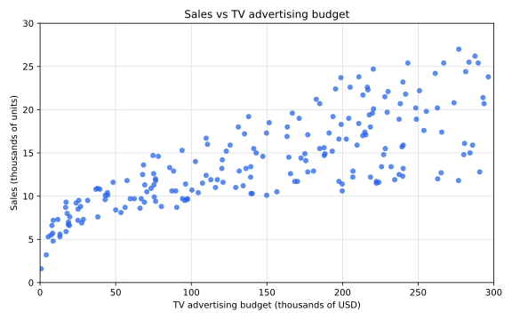

The plot can be regenerated with [`plot_advertising_data.py`](scripts/plot_advertising_data.py).

## Notation

- \(m\): number of training examples;
- \(x\): input variable or feature;
- \(y\): output or target variable;
- \((x^{(i)}, y^{(i)})\): the \(i\)-th training example;
- \(\hat{y}\): predicted target value.

| Training example | TV budget \(x\) | Sales \(y\) |
| ---: | ---: | ---: |
| \(i = 1\) | 230.1 | 22.1 |
| \(i = 2\) | 44.5 | 10.4 |

For the first two rows of the advertising data:

$$
x^{(1)} = 230.1, \qquad y^{(1)} = 22.1
$$

$$
x^{(2)} = 44.5, \qquad y^{(2)} = 10.4
$$

## Simple Linear Regression

With one feature, the model is a straight line:

$$
\hat{y} = h_\theta(x) = \theta_0 + \theta_1x
$$

where:

- \(h_\theta(x)\) is the model's **hypothesis function**: it takes an input \(x\) and returns the predicted value \(\hat{y}\); the subscript \(\theta\) indicates that the function depends on the parameters \(\theta_0\) and \(\theta_1\);
- \(h_\theta(x)\) is often abbreviated to \(h(x)\);
- \(\theta_0\) is the intercept, meaning the prediction when \(x = 0\);
- \(\theta_1\) is the slope, meaning the change in the prediction for a one-unit increase in \(x\).

Different parameter values produce different lines. Training the model means finding values of \(\theta_0\) and \(\theta_1\) that fit the training observations well.

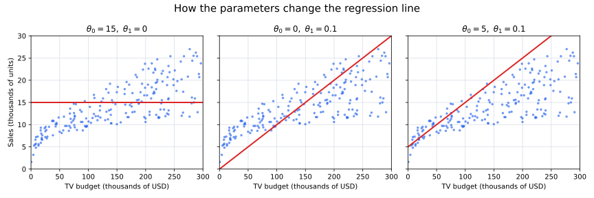

In these examples, setting \(\theta_1 = 0\) produces a horizontal line. Increasing \(\theta_0\) moves the line upwards, while a positive \(\theta_1\) makes it rise as \(x\) increases. The figure can be regenerated with [`plot_linear_model_parameters.py`](scripts/plot_linear_model_parameters.py).

## How to choose model parameters \(\theta\)?

Each choice of \(\theta_0\) and \(\theta_1\) produces a different line. To choose between them, we need to measure how far the model's predictions are from the observed target values. We use the **least-squares cost function**, which assigns a cost to each pair of parameter values: a lower cost indicates a better fit to the training data.

The idea is to choose \(\theta_0\) and \(\theta_1\) so that the prediction \(h_\theta(x^{(i)})\) is close to the observed value \(y^{(i)}\) for every training example. In the graph, this difference is the vertical gap between a data point and the line. Smaller gaps indicate better predictions.

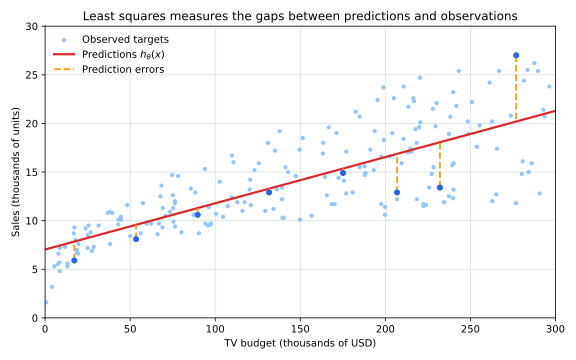

In the **least-squares** approach, each prediction error is squared and the squared errors are averaged over all \(m\) training examples:

$$
J(\theta_0, \theta_1)
= \frac{1}{m}\sum_{i=1}^{m}
\left(h_\theta(x^{(i)}) - y^{(i)}\right)^2
$$

Training means selecting the values of \(\theta_0\) and \(\theta_1\) that minimise \(J\). Squaring the errors makes every contribution non-negative and penalises larger errors more strongly.

The squared error contributed by a single training example \(i\) can be written as:

$$
l_i(\theta_0, \theta_1)
= \left(h_\theta(x^{(i)}) - y^{(i)}\right)^2
$$

The cost function can therefore also be written as:

$$
J(\theta_0, \theta_1)
= \frac{1}{m}\sum_{i=1}^{m}l_i(\theta_0, \theta_1)
$$

The figure can be regenerated with [`plot_least_squares_idea.py`](scripts/plot_least_squares_idea.py).

> Absolute errors could also be used, but they are less convenient for derivative-based optimisation. If \(e\) is the prediction error, the derivative of \(|e|\) is \(-1\) for \(e<0\), \(1\) for \(e>0\), and is undefined at \(e=0\). In contrast, the derivative of \(e^2\) is \(2e\), which is defined and continuous everywhere. The squared-error cost is therefore smoother and easier to minimise using gradient-based methods.

### Small Example

Suppose the training set contains only two examples, \((3,1)\) and \((2,1)\). To keep the example simple, assume that the intercept is already known and fixed at \(\theta_0=0\). We therefore need to choose only \(\theta_1\), and the model becomes:

$$
h_\theta(x)=\theta_1x
$$

For the two training examples:

| \(i\) | \(x^{(i)}\) | \(y^{(i)}\) | Prediction \(h_\theta(x^{(i)})\) | Squared error |
| ---: | ---: | ---: | ---: | ---: |
| 1 | 3 | 1 | \(3\theta_1\) | \((3\theta_1-1)^2\) |
| 2 | 2 | 1 | \(2\theta_1\) | \((2\theta_1-1)^2\) |

Since \(m=2\), the cost is the average of these two squared errors:

$$
J(\theta_1)
= \frac{1}{2}\left[(3\theta_1 - 1)^2 + (2\theta_1 - 1)^2\right]
$$

**Question:** What value of \(\theta_1\) minimises \(J(\theta_1)\)?

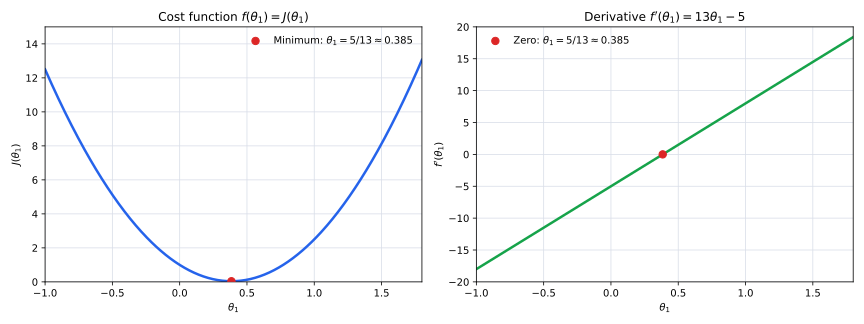

The left graph suggests that the minimum is near \(\theta_1=0.4\). To find its exact position, let \(f(\theta_1)=J(\theta_1)\) and calculate its derivative. The derivative \(f'(\theta_1)\), shown on the right, gives the slope of the cost curve. At the bottom of this smooth parabola, the tangent is horizontal, so its slope is zero: \(f'(\theta_1)=0\).

Using the chain rule:

$$
\begin{aligned}
f'(\theta_1)
&= \frac{1}{2}\left[2(3\theta_1-1)\cdot3 + 2(2\theta_1-1)\cdot2\right] \\
&= 13\theta_1-5
\end{aligned}
$$

Set the derivative equal to zero and solve for \(\theta_1\):

$$
13\theta_1-5=0
\quad\Longrightarrow\quad
\theta_1 = \frac{5}{13} \approx 0.385
$$

Because \(f\) is a convex parabola, this stationary point is its unique global minimum.

The graph can be regenerated with [`plot_small_cost_example.py`](scripts/plot_small_cost_example.py).

## Residuals and Model Assessment

The residual for training example \(i\) is the difference between the measured and predicted values:

$$
r^{(i)} = y^{(i)} - h_\theta(x^{(i)})
$$

Geometrically, the residual is the signed vertical distance between an observed point and the model's prediction. A positive residual means that the observed value is above the prediction; a negative residual means that it is below the prediction. A residual near zero indicates a close prediction.

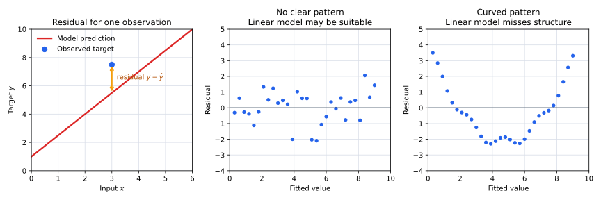

A residual plot helps assess whether the model is suitable:

- residuals scattered without a clear pattern support the use of the model;
- visible structure may indicate that a straight line does not capture an important relationship;
- residual variation can also help estimate uncertainty around predictions.

The figure can be regenerated with [`plot_residual_diagnostics.py`](scripts/plot_residual_diagnostics.py).

## Gradient Descent

Brute-force search over every possible pair \((\theta_0, \theta_1)\) is inefficient. Gradient descent instead starts from initial parameter values and repeatedly changes them in a direction that reduces the cost.

For a convex, bowl-shaped cost function, gradient descent can reach the global minimum. For a non-convex function with several minima, it may instead converge to a local minimum.

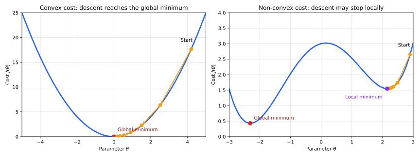

Each orange arrow represents one parameter update in the direction opposite to the slope. With a suitable learning rate, the cost decreases at each step. In the non-convex example, the final minimum depends on the starting point.

When the model has two parameters, the cost is written as \(J(\theta_0,\theta_1)\) and can be visualised as a 3D surface. The horizontal axes represent the two parameter values, while the vertical axis represents the resulting cost. Each path below shows how both parameters change together during gradient descent.

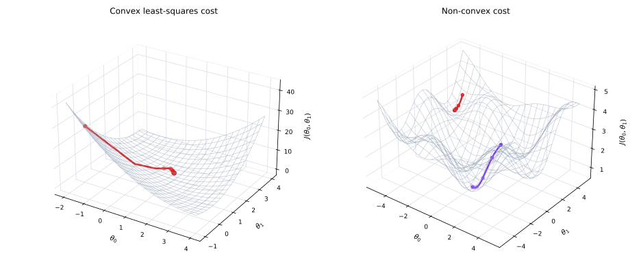

The least-squares cost for linear regression is convex, so its surface has one global minimum. The non-convex surface is a generic comparison rather than the cost function of this linear-regression model; different starting points can lead to different valleys.

The figures can be regenerated with [`plot_gradient_descent.py`](scripts/plot_gradient_descent.py) and [`plot_gradient_descent_3d.py`](scripts/plot_gradient_descent_3d.py).

## Derivatives and Gradients

### 1. Derivative for One Input

Suppose \(f(x)\) has one input. Its derivative \(f'(a)\) is the slope of the tangent line at \(x=a\):

- \(f'(a)>0\): the function is increasing near \(a\);
- \(f'(a)<0\): the function is decreasing near \(a\);
- \(f'(a)=0\): the tangent is horizontal, so \(a\) may be a minimum, maximum, or another stationary point.

Near \(a\), the tangent line approximates the function:

$$
f(x) \approx f(a) + f'(a)(x-a)
$$

For example, if \(f(x)=x^2\) and \(a=1\), then \(f'(1)=2\). The tangent-line approximation is therefore \(f(x)\approx1+2(x-1)\).

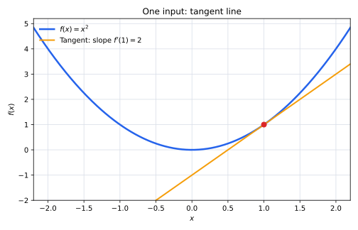

### 2. From a Tangent Line to a Tangent Plane

Now suppose the input is a vector with two components:

$$
\mathbf{x}
=
\begin{bmatrix}
x_1 \\
x_2
\end{bmatrix}
$$

A function \(f(\mathbf{x})=f(x_1,x_2)\) assigns one output to every pair \((x_1,x_2)\). Its graph is therefore a surface in 3D: the horizontal axes are \(x_1\) and \(x_2\), and the height is \(f(x_1,x_2)\). The equivalent of the tangent line is now a **tangent plane**.

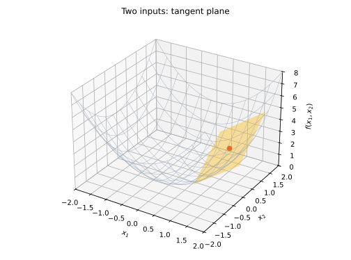

### 3. Partial Derivatives and the Gradient

The surface can have a different slope in each input direction:

- \(\frac{\partial f}{\partial x_1}\) measures how \(f\) changes when \(x_1\) changes while \(x_2\) is fixed;
- \(\frac{\partial f}{\partial x_2}\) measures how \(f\) changes when \(x_2\) changes while \(x_1\) is fixed.

The **gradient** collects these partial derivatives into one column vector:

$$
\nabla f(\mathbf{x})
=
\begin{bmatrix}
\frac{\partial f}{\partial x_1} \\
\frac{\partial f}{\partial x_2}
\end{bmatrix}
$$

At a point \(\mathbf{a}\), the tangent-plane approximation is:

$$
f(\mathbf{x})
\approx
f(\mathbf{a})
+ \nabla f(\mathbf{a})^T(\mathbf{x}-\mathbf{a})
$$

For example, let \(f(x_1,x_2)=x_1^2+x_2^2\) and \(\mathbf{a}=[1,1]^T\). Then:

$$
\nabla f(\mathbf{a})
=
\begin{bmatrix}
2x_1 \\
2x_2
\end{bmatrix}_{\mathbf{x}=\mathbf{a}}
=
\begin{bmatrix}
2 \\
2
\end{bmatrix}
$$

Therefore, the tangent plane is:

$$
f(\mathbf{x})
\approx
2+2(x_1-1)+2(x_2-1)
$$

### 4. Why the Gradient Is Used in Gradient Descent

The gradient \(\nabla f\) points in the direction of the steepest local increase of the function. The opposite direction, \(-\nabla f\), gives the steepest local decrease. Gradient descent therefore subtracts a scaled gradient from the current parameters to reduce the cost.

The figures can be regenerated with [`plot_derivatives_and_gradients.py`](scripts/plot_derivatives_and_gradients.py).

## Gradient Descent for Simple Linear Regression

At each iteration, update both parameters using learning rate \(\alpha\):

$$
\theta_0
\leftarrow
\theta_0
- \alpha\frac{\partial J}{\partial\theta_0}
$$

$$
\theta_1
\leftarrow
\theta_1
- \alpha\frac{\partial J}{\partial\theta_1}
$$

For the cost function used in this lecture:

$$
\frac{\partial J}{\partial\theta_0}
= \frac{2}{m}\sum_{i=1}^{m}
\left(h_\theta(x^{(i)})-y^{(i)}\right)
$$

$$
\frac{\partial J}{\partial\theta_1}
= \frac{2}{m}\sum_{i=1}^{m}
\left(h_\theta(x^{(i)})-y^{(i)}\right)x^{(i)}
$$

Both new parameter values should be calculated from the same old parameter values before either update is applied.

### How the Algorithm Works

1. Choose initial values for \(\theta_0\) and \(\theta_1\), often zero.
2. Use the current parameters to predict every training target.
3. Calculate the prediction errors and the two partial derivatives of \(J\).
4. Update \(\theta_0\) and \(\theta_1\) simultaneously in the direction opposite to the gradient.
5. Repeat until the cost changes by less than a chosen threshold or the maximum number of iterations is reached.

## Practical Considerations

### Feature Normalisation

Features with very different numerical ranges can cause numerical problems and make large-valued features dominate the optimisation. Normalisation rescales features to comparable ranges and often makes gradient descent converge more efficiently.

Without normalisation, linear regression can still represent the same relationship, but gradient descent may converge much more slowly.

**Standardisation (z-score normalisation).** This method subtracts the feature mean and divides by its standard deviation:

$$
x_j \leftarrow \frac{x_j-\mu_j}{\sigma_j}
$$

where:

$$
\mu_j = \frac{1}{m}\sum_{i=1}^{m}x_j^{(i)}
$$

$$
\sigma_j
= \sqrt{\frac{1}{m}\sum_{i=1}^{m}
\left(x_j^{(i)}-\mu_j\right)^2}
$$

This gives the feature approximately zero mean and unit scale.

**Min-max scaling.** This method uses the minimum and maximum observed values:

$$
x_j
\leftarrow
\frac{x_j-\min_i x_j^{(i)}}
{\max_i x_j^{(i)}-\min_i x_j^{(i)}}
$$

which maps the observed range to approximately \([0,1]\). The constant intercept feature \(x_0 = 1\) must not be normalised.

The following example applies both methods independently to the `age` and `income` features of seven people. `Person` is only an observation label and is not normalised.

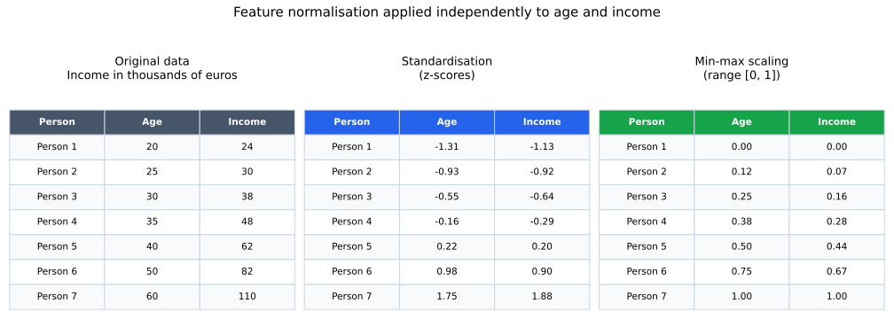

The figure can be regenerated with [`plot_feature_normalisation_tables.py`](scripts/plot_feature_normalisation_tables.py).

**Which method should be used?**

- **Standardisation** is usually preferable when features do not have fixed natural bounds or future values may fall outside the range observed during training. It centres the data around zero, but it does not restrict values to a fixed interval.
- **Min-max scaling** is useful when a bounded range such as \([0,1]\) is required or meaningful. However, it is particularly sensitive to outliers because the minimum and maximum determine the scale of every value.

Neither method is always better. In both cases, the required statistics must be calculated from the training data and then reused unchanged to transform validation, test, and future data.

### Stopping Criteria

The cost \(J(\theta)\) should decrease after every correctly configured gradient-descent iteration. Training can stop when:

- the decrease in cost becomes smaller than a threshold, such as \(10^{-2}\); or
- a fixed maximum number of iterations, such as 200, is reached.

### Selecting the Learning Rate

- If \(\alpha\) is too small, convergence is very slow.
- If \(\alpha\) is too large, updates may overshoot the minimum or fail to converge.
- The value should be adjusted so that the cost decreases in a reasonable number of iterations.
- Automated methods such as **line search** test several candidate step sizes at each iteration and select one that sufficiently decreases the cost.

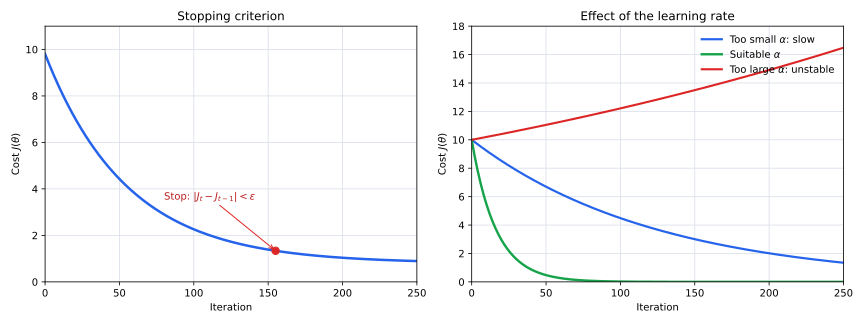

The left panel shows a typical cost curve used for a stopping decision; its exact shape depends on the data and optimiser. The right panel shows how the learning rate affects convergence. The figure can be regenerated with [`plot_training_diagnostics.py`](scripts/plot_training_diagnostics.py).

The same behaviour can be viewed directly in parameter space. Each arrow below represents one update \(\theta\leftarrow\theta-\alpha J'(\theta)\). A small \(\alpha\) produces short steps, a suitable \(\alpha\) may cross the minimum while still converging, and an excessively large \(\alpha\) produces growing oscillations.

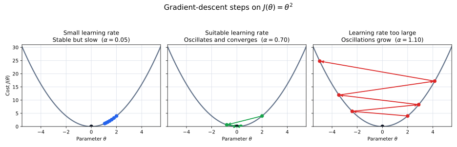

The figure can be regenerated with [`plot_learning_rate_parameter_steps.py`](scripts/plot_learning_rate_parameter_steps.py).

## Presenting Plots

For assignments and project reports:

- label every axis;
- ensure that text, numbers, colours, lines, and markers are legible;
- clearly explain what data the plot shows;
- do not provide code without an interpretation of the resulting figure.

## Multiple Linear Regression

With \(n\) features, training example \(i\) has feature vector:

$$
x^{(i)} =
\begin{bmatrix}
x_1^{(i)} \\
x_2^{(i)} \\
\vdots \\
x_n^{(i)}
\end{bmatrix}
$$

In the advertising example, \(x_1\), \(x_2\), and \(x_3\) are the TV, radio, and newspaper budgets. For example:

$$
x^{(1)} =
\begin{bmatrix}
230.1 \\
37.8 \\
69.2
\end{bmatrix}
$$

The model becomes:

$$
h_\theta(x)
= \theta_0 + \theta_1x_1 + \theta_2x_2 + \theta_3x_3
$$

where:

- \(\theta_0\) is the **intercept**, or the predicted sales when all three advertising budgets are zero;
- \(\theta_1\), \(\theta_2\), and \(\theta_3\) are the coefficients for TV, radio, and newspaper advertising respectively.

Define the constant feature \(x_0 = 1\) and include it in the feature vector:

$$
x =
\begin{bmatrix}
x_0 \\
x_1 \\
\vdots \\
x_n
\end{bmatrix},
\qquad
\theta =
\begin{bmatrix}
\theta_0 \\
\theta_1 \\
\vdots \\
\theta_n
\end{bmatrix}
$$

The model can then be written compactly as:

$$
h_\theta(x) = \theta^T x
$$

The cost function remains:

$$
J(\theta)
= \frac{1}{m}\sum_{i=1}^{m}
\left(h_\theta(x^{(i)})-y^{(i)}\right)^2
$$

For each parameter \(j = 0,\ldots,n\):

$$
\frac{\partial J}{\partial\theta_j}
= \frac{2}{m}\sum_{i=1}^{m}
\left(h_\theta(x^{(i)})-y^{(i)}\right)x_j^{(i)}
$$

Gradient descent updates every parameter:

$$
\theta_j
\leftarrow
\theta_j
- \alpha\frac{2}{m}\sum_{i=1}^{m}
\left(h_\theta(x^{(i)})-y^{(i)}\right)x_j^{(i)}
$$

As in the one-feature case, all updates in one iteration should use the same previous parameter vector.

## Example: Modelling Advertising Data

The Advertising dataset provides a concrete example of predicting sales from two features at the same time: TV and radio advertising budgets. The same observations can be fitted with models of different complexity.

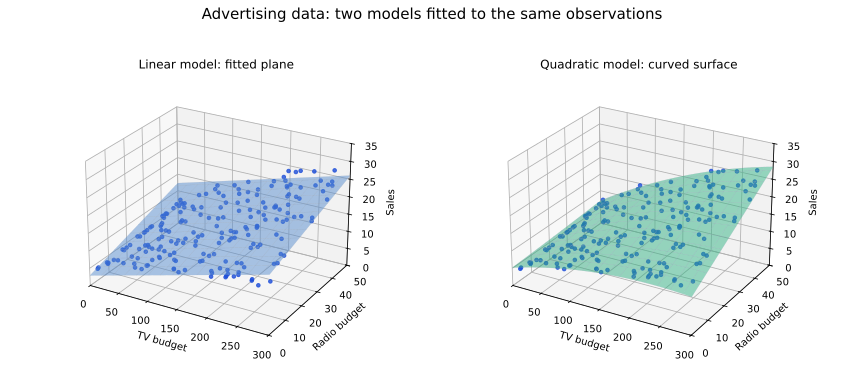

The left model uses only linear TV and radio terms, so its predictions form a plane. The right model also includes squared terms and a TV-radio interaction, allowing the fitted surface to curve. A more flexible surface may fit the training observations more closely, but its performance should still be evaluated on unseen data.

### Questions to Consider

- Does the effect of TV advertising depend on the amount spent on radio advertising?
- Does the quadratic model generalise better than the linear plane, or does it only fit the training data more closely?
- If the more flexible model is better, what does it imply for allocating the advertising budget?

These questions illustrate that choosing a useful model involves inspecting the data and checking whether the residuals or fitted surface reveal structure that a simple linear model misses.

The figure can be regenerated with [`plot_advertising_surfaces.py`](scripts/plot_advertising_surfaces.py).
