# Logistic Regression

**Date:** 2026-09-22  
**Week:** 2

## Lesson Summary

This lecture develops linear classifiers for binary and multiclass problems. It explains how logistic regression and linear support vector machines (SVMs) use the same type of decision boundary but learn it with different loss functions.

- Binary classification, feature vectors, and linear decision boundaries
- Logistic loss, 0–1 loss, and gradient descent
- Logistic regression with scikit-learn
- One-vs-rest classification for multiple classes
- SVM hinge loss, regularisation, and support vectors

---

## Classification with Two Classes

A binary classifier chooses between two labels. The opening example asks whether Johnny will like a new pie. Each training pie has a label (like or dislike) and features such as shape, filling, crust, and size. A classifier learns from those labelled examples and predicts the label of a new pie from its features.

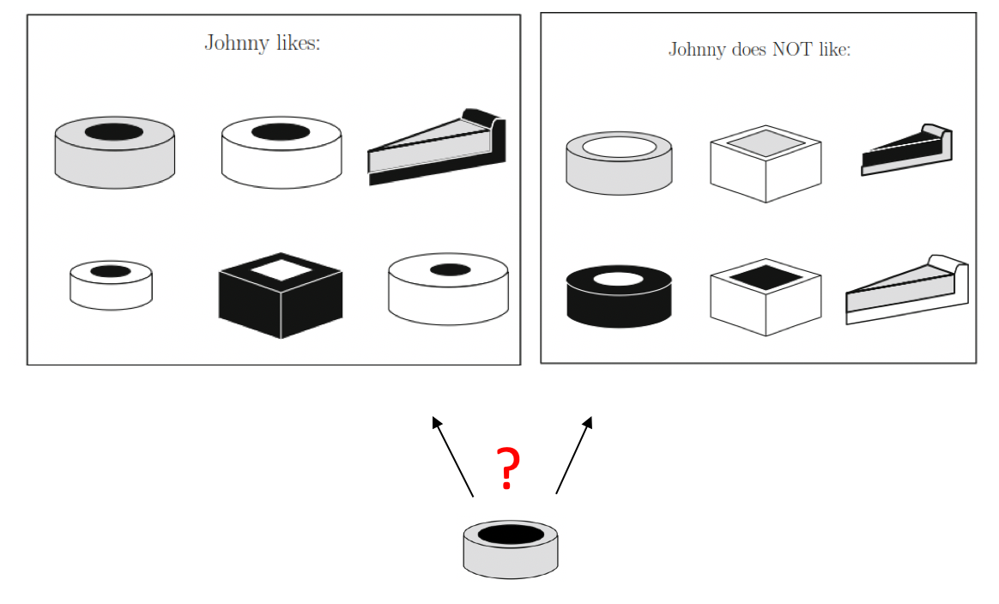

Other binary-classification questions from the lecture include:

- **Movie reviews:** Is the review positive or negative?
- **Images:** Does the picture contain a human face?
- **Loans:** Is the applicant likely to repay the loan?
- **Online advertising:** Will the person click the displayed ad?
- **Transactions:** Is the transaction fraudulent?
- **Tumours:** Is the tumour malignant or benign?

Let \(x\) be the input **feature vector** and \(y\) the target **label**. In this lecture, binary labels are encoded as \(y\in\{-1,+1\}\); an encoding of \(0\) and \(1\) would also be possible.

> Unlike linear regression, the target is a category rather than a continuous numerical value.

## Logistic Regression: Linear Decision Boundary

As in the previous lecture, set \(x_0=1\) to include an intercept. With \(n\) other features, the model first computes a linear **score**:

$$
z=\theta^T x=\theta_0+\theta_1x_1+\cdots+\theta_nx_n.
$$

Here \(\theta_0\) is the intercept and the other \(\theta_j\) are learned weights. The predicted class is

$$
h_\theta(x)=\operatorname{sign}(\theta^T x)
=\begin{cases}
+1 & \text{if }\theta^T x>0,\\
-1 & \text{if }\theta^T x<0.
\end{cases}
$$

The **decision boundary** is where \(\theta^T x=0\). A score of exactly zero is a tie, so a practical classifier needs a tie-breaking rule. The boundary is a point with one feature, a line with two features, and a hyperplane with more features. For example, \(1+0.5x_1=0\) gives the point \(x_1=-2\), while \(2+x_1+2x_2=0\) gives the line \(x_2=-x_1/2-1\).

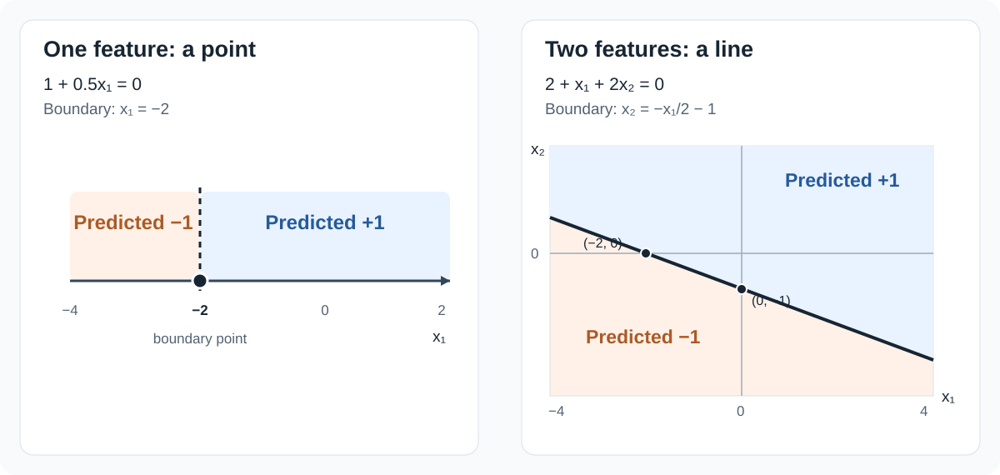

In the lecture's two-feature example, \(\theta_0=0\), \(\theta_1=0.5\), and \(\theta_2=-0.5\). Therefore:

$$
z=0.5x_1-0.5x_2,
\qquad
h_\theta(x)=+1\text{ when }x_1>x_2.
$$

The boundary is \(x_1=x_2\). The two plots below show **the same classifier** in different ways:

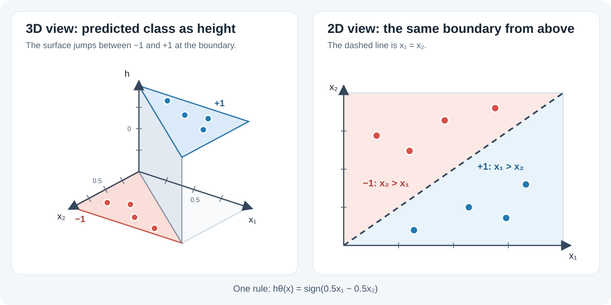

- **Left (3D):** The horizontal axes are \(x_1\) and \(x_2\); height is the predicted label \(h_\theta(x)\), either \(-1\) or \(+1\). The vertical step occurs where \(x_1=x_2\).
- **Right (2D):** Looking only at the \((x_1,x_2)\) plane, the same step appears as a dashed line. Below it, \(x_1>x_2\) and the prediction is \(+1\) (blue points); above it, the prediction is \(-1\) (red points).

The diagram can be regenerated with [`plot_decision_boundary_views.py`](scripts/3-logistic-regression/plot_decision_boundary_views.py).

Data are **linearly separable** if some linear boundary places every positive training example on one side and every negative example on the other. Not all datasets are linearly separable; a linear model can still be fitted but may misclassify some examples.

## Choosing a Cost Function

The training set contains \(m\) examples \((x^{(i)},y^{(i)})\). Three possible costs for choosing \(\theta\) are:

- **Squared error:** fit the numerical labels as in linear regression.
- **0–1 loss:** count incorrect class predictions.
- **Logistic loss:** use a smooth penalty based on the true label and score.

For each example, use these terms:

- **Input \(x\):** the feature values.
- **True label \(y\):** the known class, either \(-1\) or \(+1\).
- **Score \(z_\theta(x)=\theta^T x\):** the number calculated from \(x\) and the parameters \(\theta\). Zero is the decision boundary.
- **Prediction \(h_\theta(x)\):** \(+1\) if the score is at least zero; \(-1\) otherwise. Here a score of zero predicts \(+1\).

### Squared error

One option is to fit the raw score \(z=\theta^T x\) to labels \(y\in\{-1,+1\}\) by minimising \(\frac{1}{m}\sum_i(z^{(i)}-y^{(i)})^2\).

With squared error, the steps are:

1. Use the training inputs and true labels to find the parameters \(\theta\) that minimise squared error.
2. For a new input \(x\), calculate its score \(z_\theta(x)=\theta^T x\).
3. Turn the score into a prediction with \(h_\theta(x)=\operatorname{sign}(z_\theta(x))\).

**Suitability:** poor for classification.

**Illustrative example.** On the left, all six points are classified correctly. On the right, the added blue \(+1\) point at \(x=2.5\) is classified as \(-1\). The boundary shifts from \(x\approx3.30\) to \(x\approx2.84\), but that point remains misclassified.

The diagram can be regenerated with [`plot_squared_error_boundary_shift.py`](scripts/3-logistic-regression/plot_squared_error_boundary_shift.py).

### 0–1 loss

The 0–1 cost averages how often the classifier's predictions differ from the true labels:

$$
J_{\mathrm{0-1}}(\theta)
=\frac{1}{m}\sum_{i=1}^{m}
\mathbf{1}\!\left[h_\theta(x^{(i)})\ne y^{(i)}\right].
$$

In the graph, the horizontal value is the true label times the score, \(y z_\theta(x)\). It is negative for an incorrect prediction and positive for a correct one. The 0–1 loss is \(1\) on the negative side and \(0\) on the positive side; at zero it depends on the true label and the tie rule.

**Suitability:** useful as an error measure, but difficult to minimise with gradient descent.

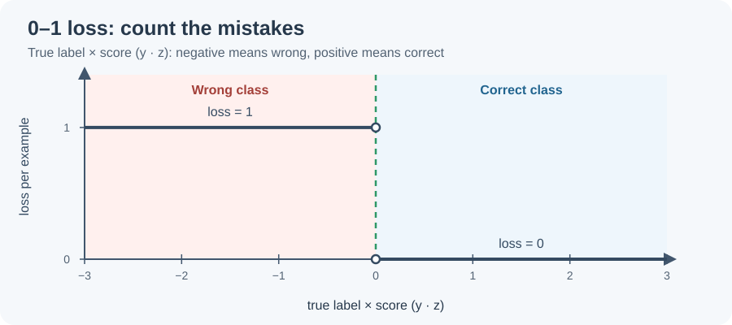

**Illustrative email example (not slide data).** Let \(x\) be the spam-keyword count. Choose the score:

$$
z_\theta(x)=\theta_0+\theta_1x=x-3,
\qquad \theta_0=-3,\quad\theta_1=1.
$$

The classifier predicts:

$$
h_\theta(x)=
\begin{cases}
+1\ \text{(spam)}, & x\ge 3,\\
-1\ \text{(normal)}, & x<3.
\end{cases}
$$

Five emails are classified correctly and one is misclassified. The 0–1 cost is:

$$
J_{\mathrm{0-1}}(\theta)=\frac{1}{6}\approx0.17.
$$

A threshold of one would make two mistakes out of six, so training would prefer the threshold of three among these two choices.

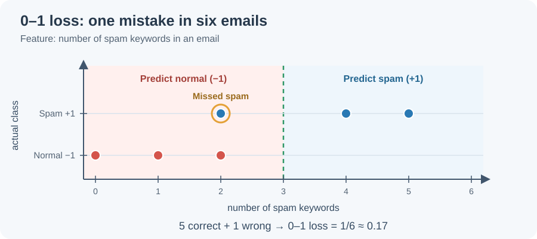

### Logistic loss

The slides define logistic regression through the average cost over the training examples. In each term, \(y^{(i)}\) is the true label and \(\theta^T x^{(i)}\) is the score:

$$
J(\theta)=\frac{1}{m}\sum_{i=1}^{m}
\log\!\left(1+e^{-y^{(i)}\theta^T x^{(i)}}\right).
$$

Each example receives a penalty based on its true label and score:

- For a \(+1\) label, a large **positive** score gives a small penalty.
- For a \(-1\) label, a large **negative** score gives a small penalty.
- A score on the wrong side of zero gives a larger penalty, which grows the farther it is from zero.

Minimising the cost therefore favours scores on the correct side and well away from the decision boundary.

**Suitability:** unlike 0–1 loss, logistic loss changes smoothly even while a prediction remains wrong, giving gradient descent a direction for improvement. At the boundary, the penalty is \(\log 2\); the slides sometimes divide by \(\log 2\) to make it \(1\), without changing the minimiser.

The graphs use the score \(\theta^T x\) on the horizontal axis, as in the slides. The left graph fixes the true label at \(+1\); the right fixes it at \(-1\). This is why a positive score has a small penalty on the left but a large penalty on the right.

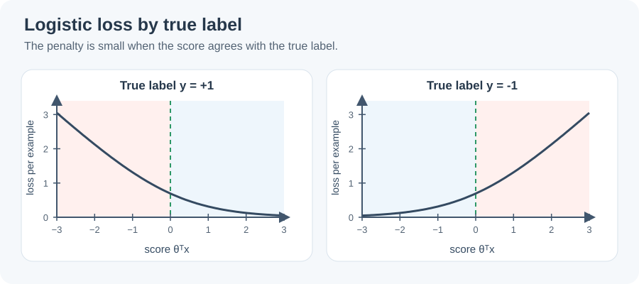

**Illustrative email example (not slide data).** Reuse the spam email with two spam keywords, so its true label is \(+1\). Keep the slope at \(\theta_1=1\) and change the intercept; the email's score is:

$$
z_\theta(2)=\theta_0+2.
$$

The penalty falls from \(2.13\) to \(1.31\) even while the prediction remains wrong. Each penalty is one term in the cost formula above; the cost averages these terms over all training emails.

These diagrams can be regenerated with [`plot_classification_losses.py`](scripts/3-logistic-regression/plot_classification_losses.py).

**Question for review:** Why is counting classification errors alone less convenient for gradient descent than using logistic loss?

## Gradient Descent for Logistic Regression

Gradient descent repeatedly updates the parameters in the direction that reduces the cost. For the intuition and the general algorithm, see [Gradient Descent in Lecture 2](2-linear-regression.md#gradient-descent).

As in linear regression, the logistic cost is differentiable and convex, so we can optimise its parameters \(\theta\) with gradient descent. Its partial derivative with respect to parameter \(\theta_j\) is

$$
\frac{\partial J}{\partial\theta_j}
=-\frac{1}{m}\sum_{i=1}^{m}
\frac{y^{(i)}x_j^{(i)}}{1+e^{y^{(i)}\theta^T x^{(i)}}},
\qquad j=0,\ldots,n.
$$

Gradient descent starts with initial parameters and repeatedly updates every parameter using a learning rate \(\alpha>0\):

$$
\theta_j\leftarrow\theta_j-\alpha\frac{\partial J}{\partial\theta_j}.
$$

At each iteration, calculate all partial derivatives using the current parameters before applying any updates. A sufficiently small learning rate allows the algorithm to move towards a lower cost. Because the cost is convex, any minimum it reaches is global. However, with perfectly separable data and no regularisation, the predictions can already be correct while increasing the weights keeps reducing the loss towards zero. In that case, the weights may grow without reaching a finite minimum.

**Illustrative cost example (not slide data).** Consider ten emails: five normal emails have 0, 1, 2, 3, and 6 spam keywords; five spam emails have 4, 5, 7, 8, and 9. Let \(x\) be the keyword count. To plot the cost against one parameter, fix the slope at \(\theta_1=1\) and vary the intercept:

$$
z_\theta(x)=\theta_0+x,
\qquad
J(\theta_0)=\frac{1}{10}\sum_{i=1}^{10}
\log\!\left(1+e^{-y^{(i)}(\theta_0+x^{(i)})}\right).
$$

The cost averages the ten individual penalties. Evaluating it for different intercepts gives the lower graph, whose minimum is at \(\theta_0=-4.5\). The decision boundary is where the score is zero:

$$
0=z_\theta(x)=-4.5+x
\quad\Longrightarrow\quad x=4.5.
$$

Keyword counts are integers, so this boundary lies between 4 and 5: counts up to 4 predict normal, and counts from 5 predict spam. Eight emails are classified correctly; the spam email at 4 and normal email at 6 remain on the wrong sides. Moving the intercept too far in either direction raises the cost, producing a convex curve with a finite minimum.

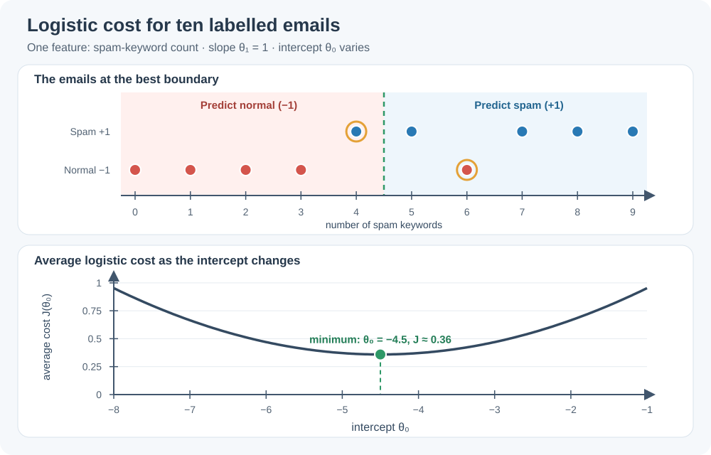

The diagram can be regenerated with [`plot_logistic_cost_ten_emails.py`](scripts/3-logistic-regression/plot_logistic_cost_ten_emails.py).

## Logistic Regression with Multiple Classes

Some tasks have more than two labels, such as assigning an email to work, friends, family, or hobby, or predicting sunny, cloudy, rainy, or snowy weather. The lecture presents **one-vs-rest** classification:

1. **Relabel the training data:** For each class, mark its examples \(+1\) and every other example \(-1\). For example, the Cloudy classifier treats Cloudy days as \(+1\) and Sunny, Rain, and Snow days as \(-1\).
2. **Train the classifiers:** Train one binary classifier for each relabelled class. The four weather classes therefore produce four classifiers.
3. **Predict a new example:** Give the same new day to all four classifiers. Each calculates a score for its class; choose the class with the highest score.

The same idea can be viewed geometrically. With illustrative features \(x_1\) (temperature) and \(x_2\) (precipitation), each lower plot treats one weather class as \(+1\), the others as \(-1\), and draws its own linear boundary.

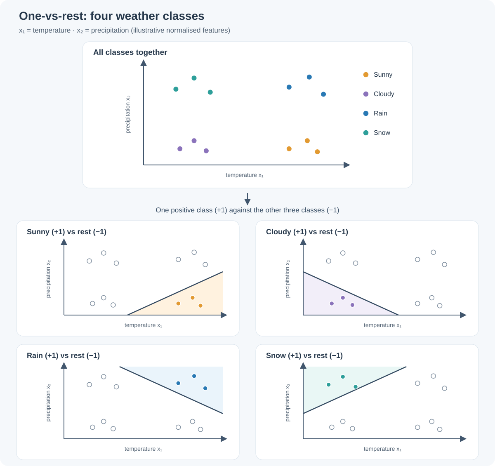

The diagram can be regenerated with [`plot_one_vs_rest_weather_boundaries.py`](scripts/3-logistic-regression/plot_one_vs_rest_weather_boundaries.py).

**Note:** `sign` turns each score into \(+1\) or \(-1\), not a probability. Several classifiers may return \(+1\), or none may; choosing the highest score still selects one class.

**Illustrative weather example.** Use four classes: Sunny (original label 0), Cloudy (1), Rain (2), and Snow (3). For each class, turn its examples into \(+1\) and the other examples into \(-1\), then train a separate binary classifier.

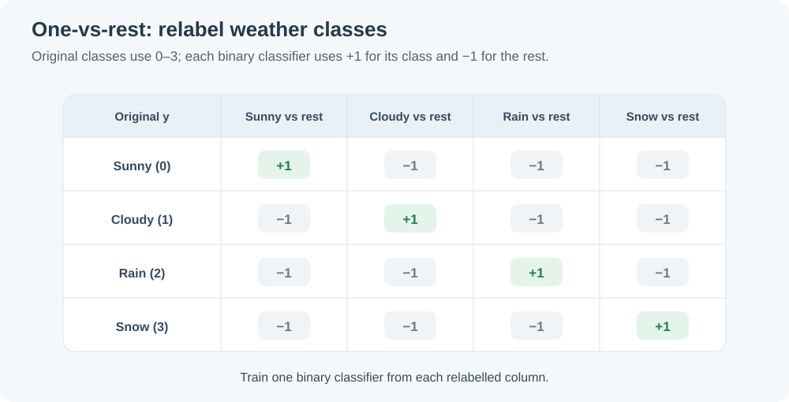

For a new cool, overcast day, suppose the trained classifiers return scores of \(-1.2\) for Sunny, \(+1.3\) for Cloudy, \(-0.4\) for Rain, and \(-1.5\) for Snow. Cloudy has the highest score, so it is the selected class.

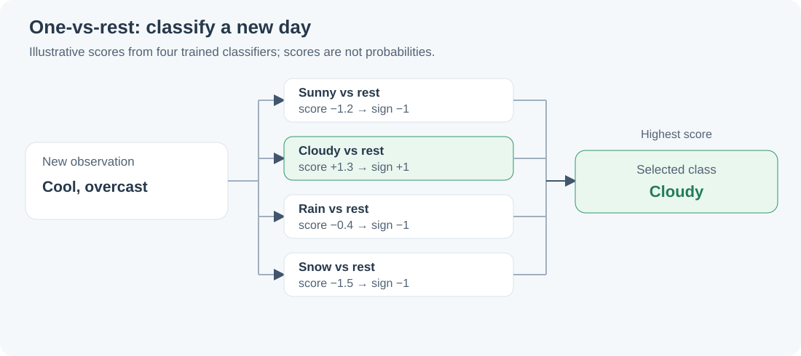

The diagrams can be regenerated with [`plot_one_vs_rest_weather_example.py`](scripts/3-logistic-regression/plot_one_vs_rest_weather_example.py).

## SVM: Hinge Loss and Regularisation

A linear support vector machine (SVM) uses the same score and prediction rule as logistic regression:

$$
h_\theta(x)=\operatorname{sign}(\theta^T x).
$$

The difference is how the parameters \(\theta\) are learned: an SVM uses **hinge loss** instead of logistic loss. For one training example, its penalty is

$$
\max(0,1-y\theta^T x).
$$

Here, \(y\) is the true label (\(+1\) or \(-1\)); \(\theta^T x\) is the score. Hinge loss assigns **zero penalty** when:

- \(y=+1\) and \(\theta^T x\ge1\);
- \(y=-1\) and \(\theta^T x\le-1\).

The graph overlays **hinge loss** (dark) and **logistic loss** (orange) for each true label. As in the slides, the logistic loss is divided by \(\log(2)\), so both losses equal \(1\) at score zero. The green dashed line marks the decision boundary. Hinge loss becomes exactly zero at the stated thresholds; logistic loss decreases smoothly towards zero without reaching it.

The diagram can be regenerated with [`plot_hinge_loss.py`](scripts/3-logistic-regression/plot_hinge_loss.py).

For \(y=+1\), a correct prediction can still receive a penalty when its score is below \(1\):

| Example with \(y=+1\) | Prediction | Hinge loss |
| --- | --- | --- |
| \(\theta^T x=2\) | Correct | \(0\) |
| \(\theta^T x=0.5\) | Correct, but below the zero-penalty threshold | \(0.5\) |
| \(\theta^T x=-1\) | Incorrect | \(2\) |

### Why add regularisation?

For any positive number \(k\), replacing \(\theta\) with \(k\theta\) multiplies every score by \(k\). It does **not** change the sign of a score or where the score is zero. Therefore, the predictions and decision boundary stay the same.

**Illustrative example (not slide data).** With one feature \(x_1\), compare these two score functions:

$$
z_\theta(x_1)=x_1-3,
\qquad
z_{2\theta}(x_1)=2x_1-6.
$$

Both cross zero at \(x_1=3\). For a \(+1\) example at \(x_1=3.5\), the first score is \(0.5\) and its hinge loss is \(0.5\). Doubling \(\theta\) raises the score to \(1\) and reduces the hinge loss to \(0\), although the predicted class and boundary have not changed.

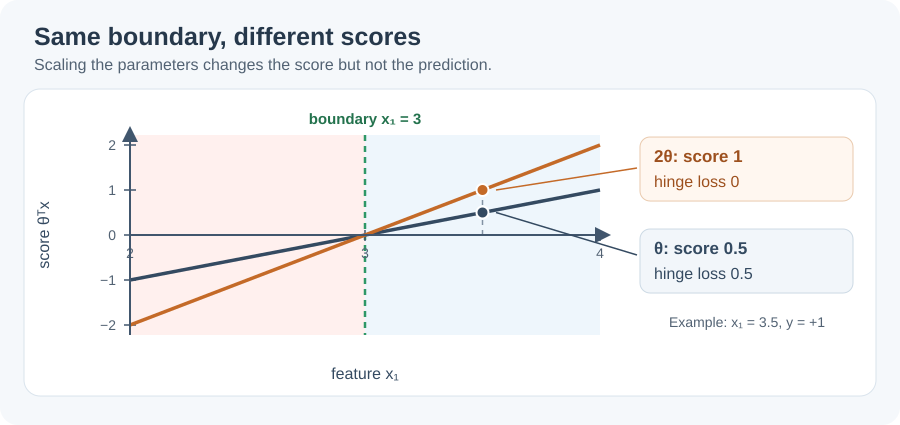

The diagram can be regenerated with [`plot_svm_scaling.py`](scripts/3-logistic-regression/plot_svm_scaling.py).

If the training data can be separated, increasing this scale enough makes **every** hinge loss zero. Scaling further does not improve predictions or hinge loss; it only makes the weights larger. **Regularisation** penalises those larger weights, so the SVM balances fitting the training examples against keeping the weights small:

$$
J(\theta)=\frac{1}{m}\sum_{i=1}^{m}
\max(0,1-y^{(i)}\theta^T x^{(i)})
+\frac{1}{C}\sum_{j=1}^{n}\theta_j^2,
\qquad C>0.
$$

The first term is the **average hinge loss** over the \(m\) examples. The second is **regularisation**: it penalises large weights \(\theta_1,\ldots,\theta_n\). A larger \(C\) makes this penalty less important relative to fitting the training examples. The slides write the penalty as \(\theta^T\theta/C\); the sum above makes explicit that \(\theta_0\) is excluded.

### Which examples matter during training?

An example with \(y^{(i)}\theta^T x^{(i)}>1\) has zero hinge loss and does not affect the hinge-loss part of the update. Examples at or inside this threshold, including incorrect predictions, are the **support vectors** that can affect the fitted boundary.

Hinge loss has a corner at \(y\theta^T x=1\), so its derivative is not defined there. The slides use **subgradient descent** to minimise the convex cost: it updates \(\theta\) as gradient descent does, choosing a valid subgradient at the corner. See [Lecture 2](2-linear-regression.md) for the gradient descent update.

## Logistic Regression and Linear SVM at a Glance

| Aspect | Logistic regression | Linear SVM |
| --- | --- | --- |
| Prediction boundary | \(\theta^T x=0\) | \(\theta^T x=0\) |
| Example loss | \(\log(1+e^{-y\theta^T x})\) | \(\max(0,1-y\theta^T x)\) |
| Beyond the margin | Loss keeps decreasing towards zero | Hinge loss is exactly zero at margin \(\geq1\) |
| Optimisation | Smooth convex loss | Convex loss with a non-smooth corner |
