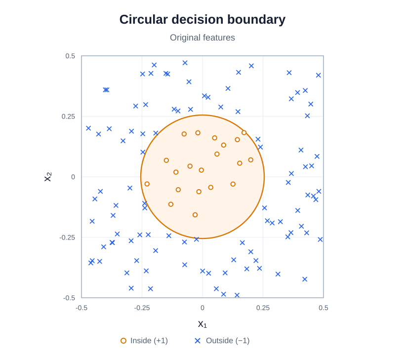
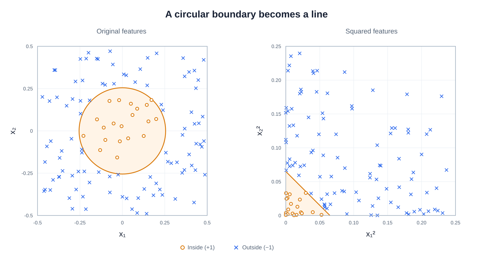
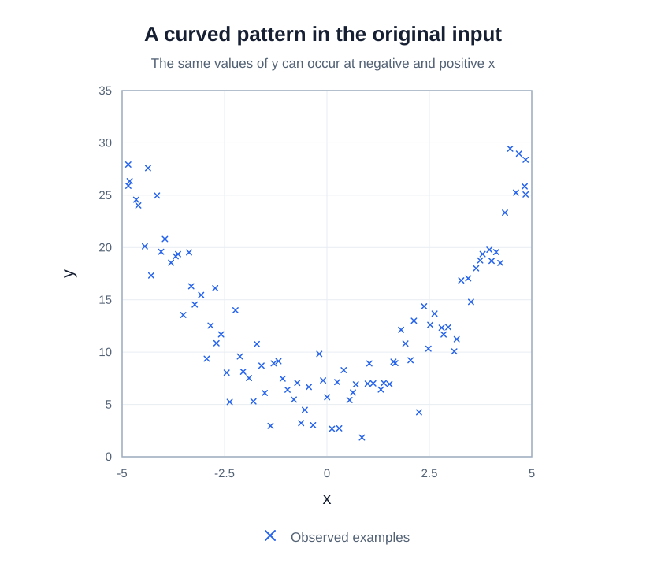
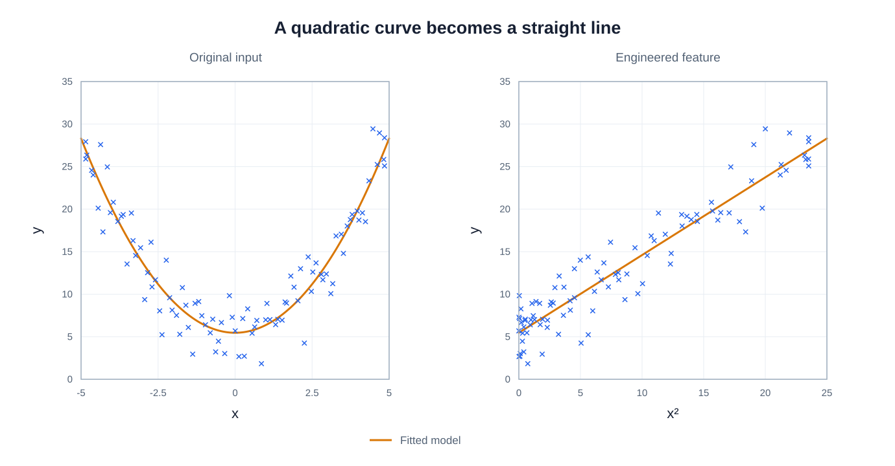
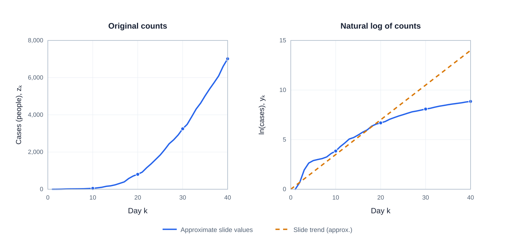
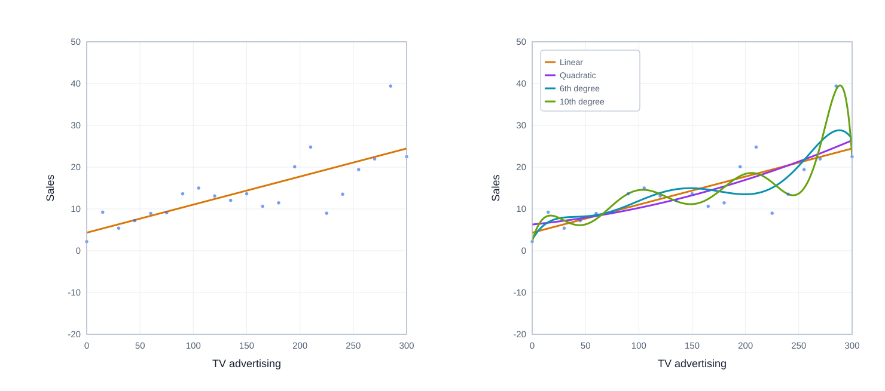
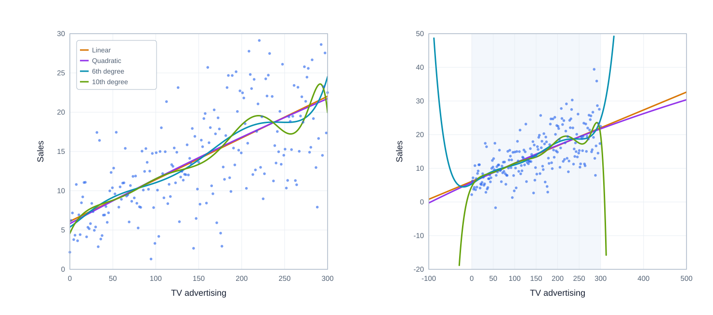
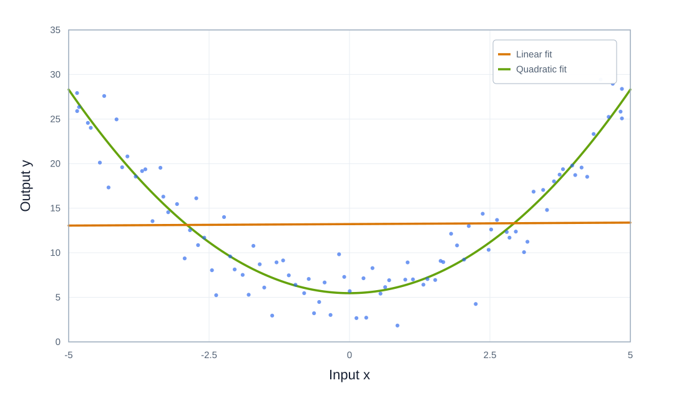

# Feature Engineering

**Date:** 2026-09-24  
**Week:** 2

## Lesson Summary

This lecture shows how transforming inputs or outputs lets a linear model describe some nonlinear patterns. It then explains why adding features and parameters must be balanced against the risk of poor generalisation.

- Feature mappings for circular classification boundaries and curved regression functions
- Normalisation, polynomial features, and interactions
- Log-transforming an exponential output before linear regression
- Hand-crafted and automatically learned features
- Model selection, overfitting, underfitting, and the bias–variance trade-off

---

## Linear Models with Engineered Features

A linear model combines its **features** with parameters linearly. 

For regression, \(\hat y=\theta^\top x\); 
for the binary classifier used here, \(\hat y=\operatorname{sign}(\theta^\top x)\). 

With one original feature, the regression model is a straight line; with two, it is a plane. However, the features supplied to the model need not be the original inputs.

**Feature engineering** starts with available inputs, transforms or combines them into new features, and trains a model using those features. A model can therefore remain linear in its parameters while its predictions are nonlinear in the original inputs. To judge whether the change helps, compare the predictive performance of models trained with the original and engineered features.

### Circular Boundary for Classification

Suppose examples with original features \(x_1,x_2\) have labels \(-1\) or \(+1\), and a circle of radius \(R\) separates the classes.

Its boundary is \(x_1^2+x_2^2=R^2\)[^circle-radius], which a straight line in the \((x_1,x_2)\) plane cannot represent.

Define \(x_1^{\mathrm{new}}=x_1^2\) and \(x_2^{\mathrm{new}}=x_2^2\). Using this new feature vector our model can be rewritten as:

\[
\hat y=\operatorname{sign}(\theta_0+\theta_1x_1^{\mathrm{new}}+\theta_2x_2^{\mathrm{new}})
=\operatorname{sign}(\theta_0+\theta_1x_1^2+\theta_2x_2^2).
\]

The model is linear in \(x_1^{\mathrm{new}},x_2^{\mathrm{new}}\), but its score contains squared terms in the original inputs.

For a circle centred at the origin, choosing \(\theta_0=R^2\) and \(\theta_1=\theta_2=-1\) gives the boundary \(x_1^{\mathrm{new}}+x_2^{\mathrm{new}}=R^2\) and labels points inside it \(+1\).

### Curved Regression with a Linear Model

The slide's data have a noisy, roughly U-shaped relationship between the input \(x\) and output \(y\). A model using only \(x\), \(h_\theta(x)=\theta_0+\theta_1x\), is a straight line: it cannot decrease and then increase as these observations do.

Because the pattern is approximately symmetric around \(x=0\), negative and positive values of \(x\) at the same distance from zero tend to have similar outputs. Define the new feature \(u=x^2\) (the slide calls it \(x^{\mathrm{new}}\)). We can compute \(u\) from every input and fit a straight line in the new feature:

\[
h_\theta(u)=\theta_0+\theta_1u.
\]

Substituting \(u=x^2\) shows what this model predicts for the original input:

\[
h_\theta(x)=\theta_0+\theta_1x^2.
\]

Thus the **same fitted model** appears as a line when plotted against \(x^2\), but as a parabola when plotted against \(x\). The model is called *linear* because its unknown parameters \(\theta_0,\theta_1\) enter as a weighted sum; the original input does not have to enter linearly.

## Ways to Engineer Features

- **Modify one feature:** Transform the values of an existing input. For example, standardise \(x_i\) using \(x_i^{\mathrm{new}}=(x_i-\mu_i)/\sigma_i\), where \(\mu_i\) and \(\sigma_i\) are computed from the training data. Use those same values for new observations.
- **Create several features from one input:** Derive multiple features from a single input. For example, use its powers \(x_i,x_i^2,x_i^3,\ldots,x_i^q\) to let a linear model represent polynomial curves in the original input.
- **Combine inputs:** Build a new feature from two or more inputs. For example, the product \(x_jx_k\) can represent an interaction between \(x_j\) and \(x_k\).

For example, if \(x_1,x_2,x_3\) are Boolean inputs, the slide's model includes their individual effects and pairwise products:

\[
\hat y=\theta_1x_1+\theta_2x_2+\theta_3x_3+\theta_4x_1x_2+\theta_5x_1x_3+\theta_6x_2x_3.
\]

The product \(x_1x_2\) equals 1 only when both inputs equal 1, so \(\theta_4\) contributes an additional amount in that case. The analogous extra contributions are \(\theta_5\) for \(x_1,x_3\) and \(\theta_6\) for \(x_2,x_3\).

## Transforming the Output

Feature engineering changes the inputs to a model. We can also transform the **output**.

Transforming the output means applying a function to the **target values** before fitting the model, then reversing it to obtain predictions on the original scale.

In the lecture's Covid example, the **actual output of interest** is \(z_k\), the number of infected people on day \(k\). A simplified model assumes exponential growth or decay:

\[
z_k=z_0e^{ak},
\]

Here \(z_0\) is the initial count and \(a\) is the growth parameter: the count grows when \(a>0\) and decays when \(a<0\). For positive counts, taking logarithms gives

\[
\log z_k=ak+\log z_0.
\]

Define the **model output** as \(y_k=\log z_k\), with \(y_0=\log z_0\). Then

\[
y_k=ak+y_0=\theta_1k+\theta_0,
\]

where \(\theta_1=a\) and \(\theta_0=y_0\). This is linear in \(k\), so linear regression can estimate the unknown parameters from the transformed counts.

The model predicts \(\hat y_k=\hat\theta_1k+\hat\theta_0\), which is a **log count**, not a count of people. To return to counts, start from the relationship already defined above and raise \(e\) to **both sides**:

\[
y_k=\log z_k
\quad\Longrightarrow\quad
e^{y_k}=e^{\log z_k}=z_k.
\]

**Math reminder:** \(e^{\log x}=x\) for \(x>0\) (natural logarithm).

Call the predicted count \(\hat z_k\). Applying the same inverse operation to the predicted log count gives \(\hat z_k=e^{\hat y_k}=e^{\hat\theta_1k+\hat\theta_0}\).  
For example, if the model predicts \(\hat y_k=4.605\), then \(\hat z_k=e^{4.605}\approx100\) infected people.

The slide's Ireland example shows that the log counts do not follow one straight line over the whole period: the fitted exponential trend is only an approximation.

[**Personal note:** How does transforming the input differ from transforming the output? Could input feature engineering achieve the same result in this example?]

## Hand-Crafted and Learned Features

Feature selection and engineering can be done by hand using knowledge of the task. Feature mappings can also be learned from data; the slides mention word2vec and VGG16 as examples. Learning useful features automatically can require substantial data and computation.

## Model Selection: More Features Are Not Always Better

In the advertising example, there is one original input, \(x\): the TV advertising budget. A degree-\(d\) polynomial model creates powers of that input:

\[
\hat y=\theta_0+\theta_1x+\theta_2x^2+\cdots+\theta_dx^d.
\]

So a **sixth-degree** model uses powers up to \(x^6\); it does not mean six original input variables. It has six polynomial features, \(x,x^2,\ldots,x^6\), plus the intercept \(\theta_0\). A quadratic model is degree 2, so its highest power is \(x^2\). The lecture compares linear, quadratic, sixth-degree, and tenth-degree models for predicting sales from TV advertising. When the training data are thinned to every tenth point, the high-degree models bend sharply to follow individual observations. They fit noise as well as any underlying pattern, so predictions between observed points can be unreliable. This is **overfitting**.

Overfitting can also happen with many ordinary linear input features. If there are many fitted coefficients relative to the amount of training data, the model can fit noise even without polynomial terms.

The regenerated plots are illustrative: they show the same model comparisons, but use generated data rather than the original advertising measurements.

Using more training points makes the curves less erratic within the observed range, but high-degree models can still behave badly outside that range. More data can help, but it does not guarantee good generalisation or safe extrapolation.

The opposite problem is **underfitting**: a model is too simple to capture the pattern. For instance, a straight line cannot adequately describe genuinely quadratic data.

Choosing complexity means balancing underfitting against overfitting, often called the **bias–variance trade-off**. A good fit to training examples alone is not enough; the model must also predict well on data it has not fitted.

[^circle-radius]: Every point on a circle centred at the origin is at distance \(R\) from the origin. By the Pythagorean theorem, \(\sqrt{x_1^2+x_2^2}=R\); squaring both sides gives \(x_1^2+x_2^2=R^2\).
