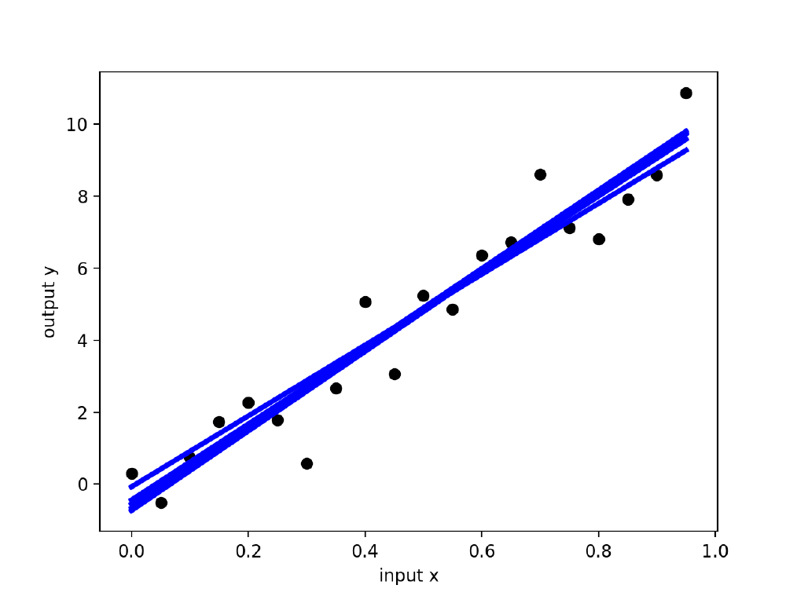
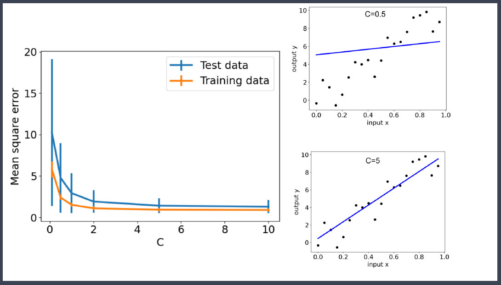
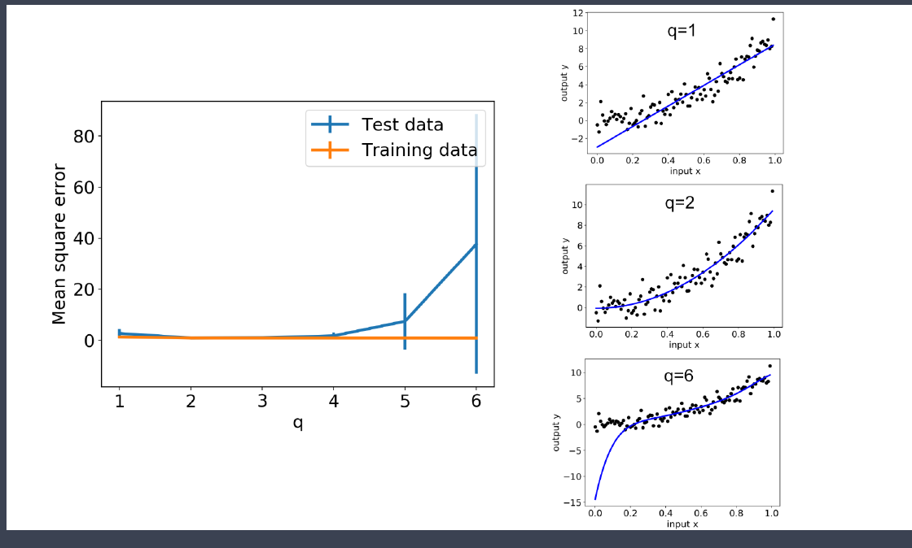
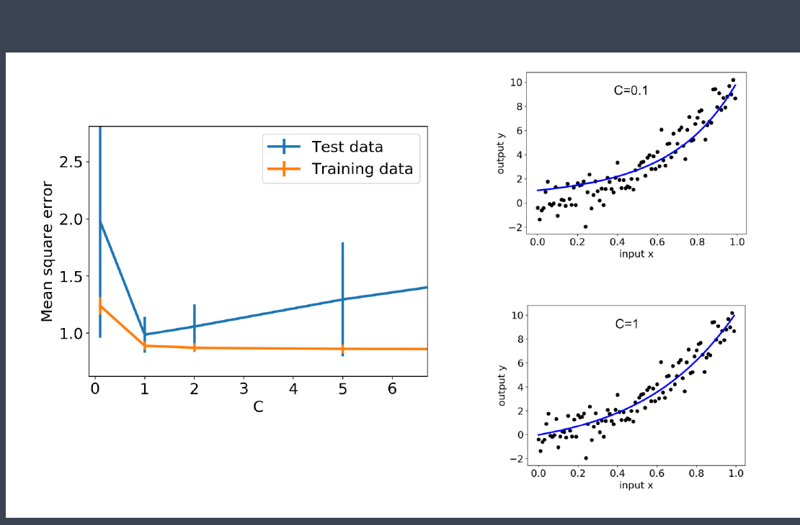
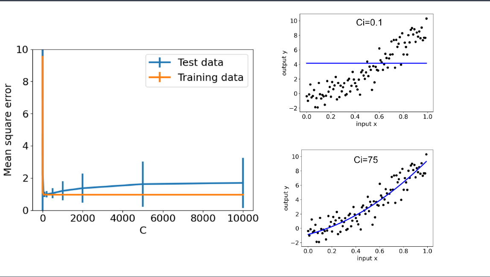
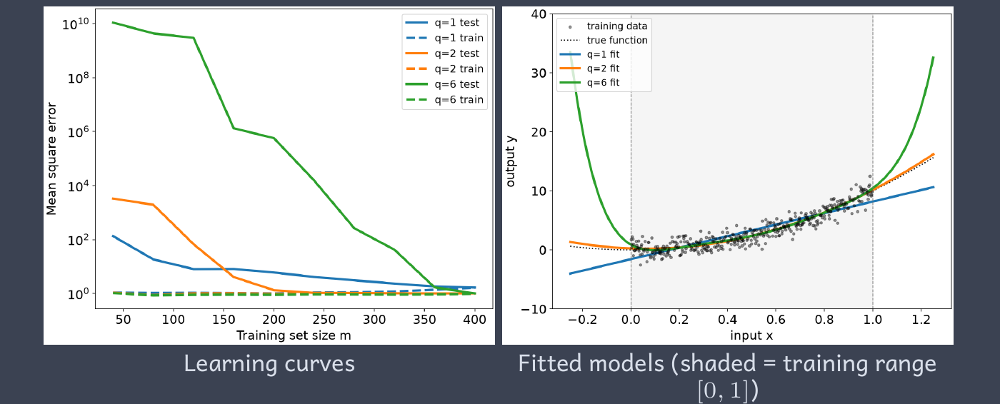

# Cross Validation

**Date:** 2026-09-29  
**Week:** 3

## Lesson Summary

This lecture explains how to estimate a model's performance on unseen data and use that evidence to choose its complexity. Cross-validation supports the selection of polynomial degree and regularisation strength, while learning curves help assess whether more training data would improve predictions.

- Hold-out evaluation and k-fold cross-validation
- Mean prediction error, variation across folds, and the choice of k
- Hyperparameter tuning for ridge regression and polynomial features
- Underfitting, overfitting, and model selection
- L2 and L1 regularisation, including LASSO regression
- Learning curves and the effect of training set size

---

## Hold-Out Method

So far, we have learned model parameters by minimising a cost function and evaluated that cost on the same training data. This tells us how well the model fits the examples it has already seen. As the previous lecture showed, a flexible model can achieve a low training error by fitting noise, so a good training fit alone is not enough.

We now want to assess **generalisation**: how well the model predicts outputs for new inputs. To do this, we evaluate it on observations that were not used to learn its parameters.

The **hold-out method** splits the available labelled data into two disjoint sets:

- **Training set:** used to learn the model parameters \(\theta\).
- **Test set:** used to evaluate predictions after fitting, without using its labels to learn \(\theta\).

The lecture suggests splits such as 80% training / 20% test or 90% / 10%. More training data can improve the fitted model, but leaves fewer observations for estimating its performance. A larger test set gives more evidence about prediction error, but reduces the data available for training.

For the lecture's independent observations, a random split avoids systematically assigning a particular part of the dataset to one set.

### Repeated Hold-Out Evaluation

The slide generates 20 observations from a straight line with noise:

\[
y^{(i)}=10x^{(i)}+\varepsilon^{(i)},
\qquad \varepsilon^{(i)}\sim\mathcal N(0,1).
\]

The same dataset is randomly split five times. In each repetition, 16 observations are used to fit a new straight-line model, and the remaining 4 are used to evaluate its predictions. The model is fitted afresh for each split.

The black points show the fixed dataset, and the blue lines show the five fitted models.  

The lines nearly overlap, but their intercepts and slopes differ because each model learns from a different subset of the observations. Each test error also depends on which four observations are held out.

The slide reports the following five results:

| Split | Intercept | Slope | Mean Square Error |
|---|---:|---:|---:|
| 1 | -0.146890 | 10.174736 | 0.680207 |
| 2 | -0.050447 | 9.898857 | 1.105285 |
| 3 | -0.154663 | 10.048717 | 1.212909 |
| 4 | -0.441200 | 10.543796 | 1.904468 |
| 5 | -0.117850 | 9.859572 | 1.412553 |

For a held-out set \(V\), **mean squared error (MSE)** is

\[
\operatorname{MSE}_V=
\frac{1}{|V|}\sum_{i\in V}\left(h_\theta(x^{(i)})-y^{(i)}\right)^2.
\]

Lower MSE is better. When evaluating a regularised model, this measures prediction error alone; it does not include the regularisation penalty used during training.

## k-Fold Cross-Validation

Repeated random hold-out splits may test some observations several times and others never. **k-fold cross-validation** uses a systematic rotation:

1. Divide the data into \(k\) folds of equal, or nearly equal, size.
2. Hold out one fold and train a fresh model on the other \(k-1\) folds.
3. Evaluate that model on the held-out fold.
4. Repeat until each fold has been held out once.
5. Summarise the \(k\) prediction errors with their mean and spread.

For \(k=5\), the arrangement is:

| Fit | Fold 1 | Fold 2 | Fold 3 | Fold 4 | Fold 5 |
|---|---|---|---|---|---|
| 1 | **Evaluate** | Train | Train | Train | Train |
| 2 | Train | **Evaluate** | Train | Train | Train |
| 3 | Train | Train | **Evaluate** | Train | Train |
| 4 | Train | Train | Train | **Evaluate** | Train |
| 5 | Train | Train | Train | Train | **Evaluate** |

Each observation is evaluated once and participates in training \(k-1\) times. The five fits have the same model specification, but usually learn different parameter values.

If the mean squared errors on the held-out folds are \(E_1,\ldots,E_k\), the summaries used by the lecture code are

\[
\bar E=\frac{1}{k}\sum_{r=1}^{k}E_r,
\qquad
s_E=\sqrt{\frac{1}{k}\sum_{r=1}^{k}(E_r-\bar E)^2}.
\]

The mean estimates typical held-out performance. The standard deviation describes how much the measured error changes across folds. Error bars of \(\bar E\pm s_E\) are **not automatically confidence intervals**; the training sets overlap, so the fold results are not independent experiments.

### Choosing k

Let \(m\) be the total number of observations and \(k\) the number of folds. With equally sized folds, each fit uses

\[
m_{\mathrm{validation}}=\frac{m}{k},
\qquad
m_{\mathrm{train}}=\frac{k-1}{k}m.
\]

There are two sources of variation: the held-out observations contain different noise, and different training observations produce different fitted parameters.

| Choice | Consequence |
|---|---|
| Smaller \(k\) | More observations per held-out fold, so each fold's error averages over more data; fewer observations remain for training. |
| Larger \(k\) | More observations per training fit, but fewer per held-out fold; more models must be fitted. |
| \(k=m\) | **Leave-one-out cross-validation:** train on \(m-1\) observations and evaluate on the remaining one, repeating \(m\) times. |

The lecture recommends \(k=5\) or \(k=10\) as common compromises. A larger \(k\) does not guarantee a more stable final estimate.

## Tuning Model Hyperparameters

Suppose we add a penalty to the linear regression cost function. The slide keeps the linear model and writes its new cost as

\[
h_\theta(x)=\theta^T x,
\qquad
J(\theta)=\frac{1}{m}\sum_{i=1}^{m}
\left(h_\theta(x^{(i)})-y^{(i)}\right)^2
+\frac{\theta^T\theta}{C}.
\]

The first term measures the prediction error on the training data. The second term penalises large coefficients: \(\theta^T\theta\) is the sum of their squares. Linear regression with this quadratic penalty is called **ridge regression**.

The coefficients \(\theta\) are **model parameters**: fitting the model learns their values from the training data. The value \(C\) is a **hyperparameter**: we choose it to control the penalty before fitting. A small \(C\) makes the penalty stronger and pushes coefficients towards zero; a large \(C\) makes it weaker. As \(C\) grows without bound, the penalty approaches zero.

**How do we choose \(C\)?** Try a range of values and perform cross-validation separately for each one. Plot the resulting prediction errors and their spread across folds, then select a value that predicts well on held-out observations. To cover a wide range quickly, increase \(C\) by factors of roughly 5 or 10: for example, \([0.1,1,10,100]\) or \([0.1,0.5,1,5,10,50,100]\).

### Ridge Regression: Choosing C

The graph shows how changing \(C\) affects the lecture's straight-line fit and its prediction errors:

The penalty is \(\theta^T\theta/C\). **Decreasing \(C\) makes this penalty stronger**, so the fitted coefficients become smaller. 
- If \(C\) is too small, the line becomes too flat and the prediction error increases. 
- Increasing \(C\) weakens the penalty and lets the line fit the data more closely.

In this graph, values of \(C\geq5\) give similarly low held-out error. To avoid overfitting, the slide recommends trying to use the **simplest model possible**: among values that predict about equally well, choose the **smallest \(C\)**.
A smaller \(C\) applies more regularisation, but a value that is too small underfits.

**Why does the validation error not rise at large C?** 
Removing the penalty still leaves a straight-line model with only an intercept and a slope. Since the generating relationship is linear, this model does not have the flexibility of a high-degree polynomial. The plotted experiment therefore shows no clear overfitting as the penalty weakens; this is not a guarantee for every dataset.

> **Assignments and projects:** Unless the instructions say otherwise, the lecturer requires cross-validation analysis to support your choice of hyperparameter values. Show the values tried, the prediction errors across folds (for example, their mean and spread), and explain why you selected the final value.

### Polynomial Features: Choosing q

The next example generates data from a quadratic relationship with noise:

\[
y=10x^2+\varepsilon,
\qquad \varepsilon\sim\mathcal N(0,1).
\]

Suppose we do not know that the true relationship is quadratic. 
We compare models using features \([1,x,x^2,\ldots,x^q]\), with \(q\in\{1,2,3,4,5,6\}\). 
Each candidate degree is evaluated by cross-validation.

- **\(q=1\):** a straight line cannot represent the quadratic relationship, producing underfitting.
- **\(q=2\):** the model can represent the generating relationship.
- **Large \(q\):** extra flexibility can fit noise, producing unstable predictions and large validation error bars.

In the slide, the mean errors for \(q=1,2,3\) appear close on the plotted scale, while \(q=2\) has smaller error bars. Selection therefore requires judgement about both error and stability.

### Combining Polynomial Features and Ridge Regression

Keep \(q=6\), use features \([1,x,x^2,x^3,x^4,x^5,x^6]\), and tune \(C\) for ridge regression. The polynomial provides flexibility, while the penalty controls how strongly that flexibility is used.

At very small \(C\), excessive shrinkage causes underfitting. As \(C\) increases, training error falls, but validation error eventually starts rising: the model can fit noise more strongly. The slide identifies \(C\approx1\) as a reasonable choice, considering the error bars. This is an example-specific result.

## Overfitting, Underfitting, and Model Selection

**Underfitting** occurs when the model is too simple to capture the underlying relationship. 
**Overfitting** occurs when it fits details of the training sample, including noise, that do not generalise well.

The lecture presents two approaches that can be used together:

| Approach | Procedure | Selection evidence |
|---|---|---|
| **Sequential model selection** | Add a feature, refit, and repeat; stop when improvement becomes small or predictions worsen. | Cross-validation performance at each step. |
| **Regularisation** | Add a penalty to the cost function and vary its strength. | Cross-validation performance for each penalty strength. |

Training error alone favours increasingly flexible models. 
Held-out error helps identify when the additional flexibility stops improving predictions.

## Regularisation: L2 and L1 Penalties

The general form is prediction loss plus \(R(\theta)/C\). The two penalties in the lecture are:

| Penalty | Expression | Main effect |
|---|---|---|
| **L2**, quadratic or Tikhonov | \(R(\theta)=\sum_{j=1}^{n}\theta_j^2\) | Shrinks coefficients; generally keeps many nonzero coefficients. |
| **L1** | \(R(\theta)=\sum_{j=1}^{n}\lvert\theta_j\rvert\) | Encourages **sparsity**: some coefficients become exactly zero. |

Linear regression with an L2 penalty is **ridge regression**. 
L2 regularisation also appears in the SVM formulation studied earlier and can be applied to logistic regression.

### LASSO Regression

Linear regression with an L1 penalty is **LASSO**:

\[
J(\theta)=\frac{1}{m}\sum_{i=1}^{m}
\left(h_\theta(x^{(i)})-y^{(i)}\right)^2
+\frac{1}{C}\sum_{j=1}^{n}|\theta_j|.
\]

The **L1 penalty tends to make as many elements of \(\theta\) zero as possible while still fitting the data**: it favours solutions that use fewer features. LASSO therefore combines fitting with a form of feature selection. A smaller \(C\) makes the penalty stronger and can set more coefficients to zero; if the penalty is too strong, the model underfits.

The slide reports these example:

- When \(C=0.1\) the models parameters \(\theta=[0,0,0,0,0,0,0]\).
- When \(C=75\) the models parameters \(\theta=[0,0,8.0237,1.6541,0,0,0]\).

The second fit retains only two nonzero feature coefficients. These are illustrative results, not fixed values produced for every noisy sample.

## Learning Curves

A **learning curve** holds the model specification fixed and plots training and held-out error against the **number of training observations**. It helps assess whether obtaining more data is likely to improve the model.

This differs from the earlier tuning plots: their horizontal axis is a hyperparameter such as \(C\) or \(q\); a learning curve's horizontal axis is training set size \(m\).

In the lecture's quadratic-data example:

- **\(q=1\):** the model is too simple. More data cannot make a straight line represent a quadratic function, so an approximation error remains.
- **\(q=2\):** the appropriate model reaches the noise floor fastest, at roughly \(m=200\) in the displayed experiment.
- **\(q=6\):** validation error is enormous with small training sets and falls as more data stabilises the fit. The fitted polynomial can still behave poorly outside the training range.

The **noise floor** is the error due to the unpredictable noise in the target. Here the added noise has variance 1, so even the correct underlying function has expected MSE 1 on fresh noisy observations.

The left plot uses a logarithmic error axis because the errors span several orders of magnitude. Its exact values are specific to the displayed experiment.