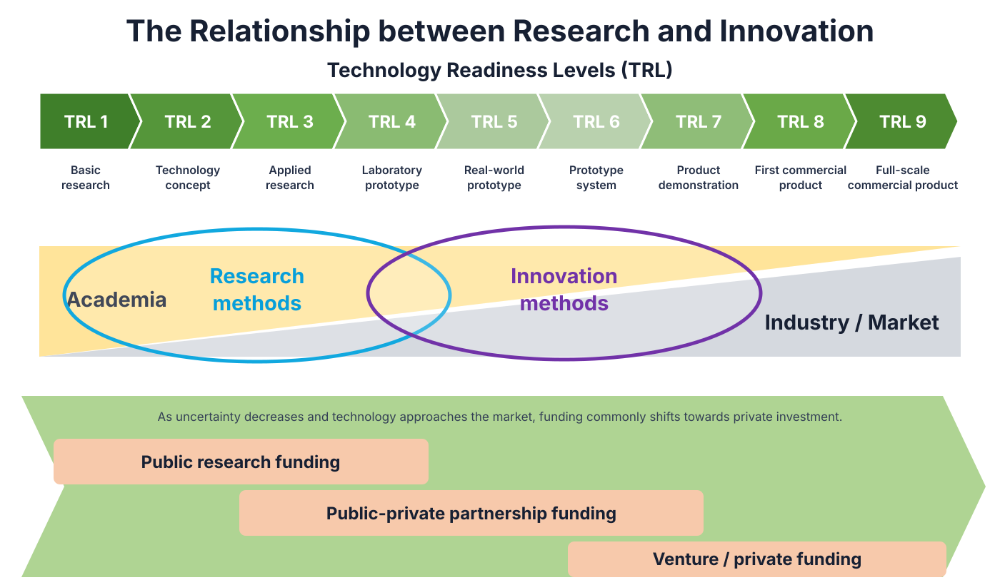

# Introduction

**Date:** 2026-09-16  
**Week:** 1

## Lesson Summary

This introductory lecture explains how research and innovation overlap, while serving different goals and audiences. It also introduces the module assessment, the responsible use of generative AI, and customer discovery as a method for developing a viable business model.

- Relationship between research, innovation, and Technology Readiness Levels
- Evidence, critical thinking, risk management, and ethical responsibility
- Opportunities and limitations of generative AI
- Group innovation project and individual research plan
- Startups, business models, and customer discovery

---

## Research and Innovation

Research and innovation form an overlapping ecosystem:

- **research** develops verifiable knowledge and is mainly directed towards researchers, funders, and the public;
- **innovation** turns ideas into useful and potentially profitable products or services for customers and investors.

Both require testable hypotheses, evidence gathering, critical assessment, risk management, and an ethical outlook. Technology Readiness Levels describe the progression from basic research to a full-scale commercial product, with research methods more prominent in the early stages and innovation methods increasingly important closer to the market.

A research question must be matched with a suitable method, such as an experiment, survey, or interview. The resulting evidence must be assessed critically, including the limits within which it can be generalised.

## Generative AI

Generative AI can support literature searches, summarisation, writing, ideation, hypothesis generation, and experiment planning. It can save time, but it may also generate inaccurate information or references, omit attribution, and produce homogenised content. Its output must therefore be checked critically rather than treated as reliable evidence.

GenAI systems also mediate access to information without always making their sources, selection criteria, or interests transparent. This may affect research and academic freedom.

The lecturer's research interests include trustworthy AI, data governance, and international AI standards.

## Ethical Responsibility

Ethical responsibility applies throughout technology development. Depending on the activity, researchers and innovators may be accountable to ethics committees, data-protection authorities, peer reviewers, funding bodies, certification authorities, or courts.

Important concerns include research integrity, risks to participants, GDPR compliance, bias, copyright, impact assessment, documentation, and professional standards.

Researchers must also consider **dual-use risk**: technology developed for a beneficial purpose may later be reused in harmful ways.

## Module and Assessment

The module combines:

- **innovation methods:** customer discovery, business-model development and testing, and responsible innovation;
- **research methods:** literature searching, research questions, research ethics, dissertation critique, planning, and academic writing.

Assessment is entirely continuous and has two main components:

- **Group assignment:** use a previous MSc dissertation as the basis for a technology-focused business idea, test its assumptions with potential customers, revise the Business Model Canvas using evidence, complete an Ethics Canvas, reflect on the use of GenAI, critique the dissertation, and present the final model.
- **Individual assignment:** develop a research question and a research plan covering at least seven relevant references, a literature-review protocol, schedule, ethical approval, required skills, possible impact, and planned use of AI.

The detailed marking scheme and submission deadlines are provided on Blackboard.

## Startups and Customer Discovery

A startup is a temporary organisation searching for a repeatable and scalable business model. Unlike an established company, which executes a known model, a startup operates under uncertainty and must search for one.

The main unknown is the customer. A technically successful product can still fail if it does not solve a problem that customers care about or are willing to pay for. The technology is only one part of the value proposition.

Customer development proceeds through customer discovery, customer validation, customer creation, and company building. The module focuses first on discovery: state assumptions as hypotheses, speak to potential customers, gather evidence outside the organisation, and revise or pivot the business model when the evidence contradicts the original plan.

Disproving an assumption or finding that a business idea is not viable is still a valid result when it is supported by evidence.
