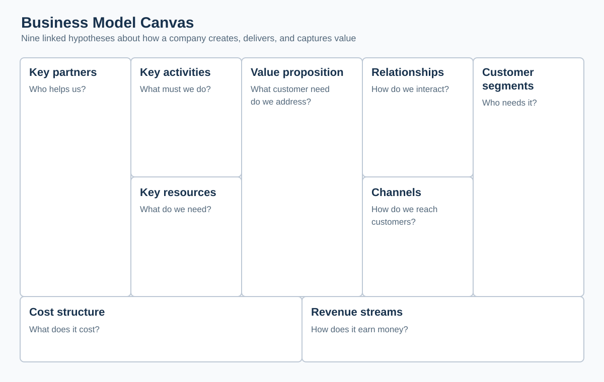
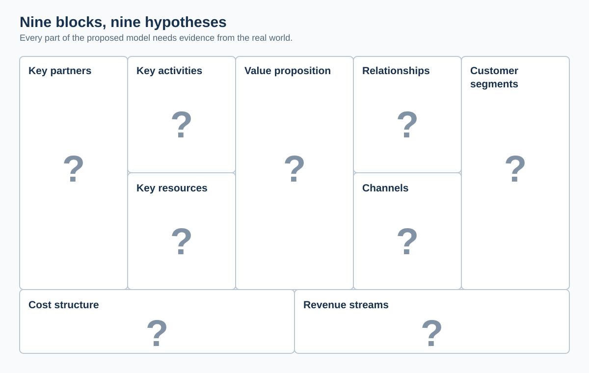
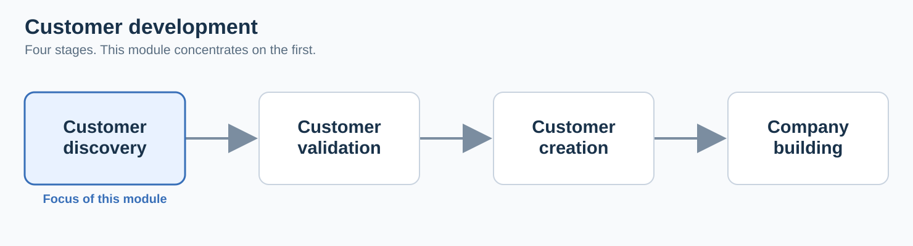
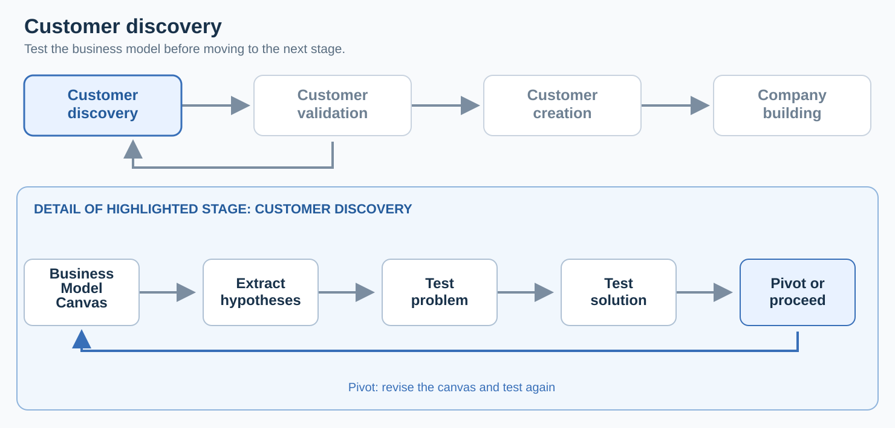
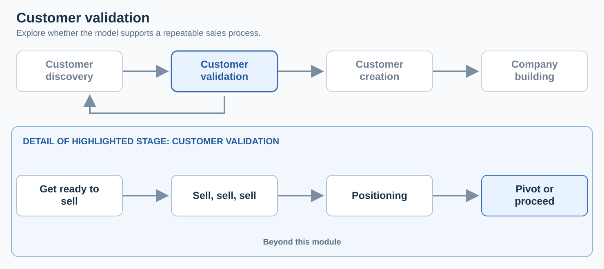
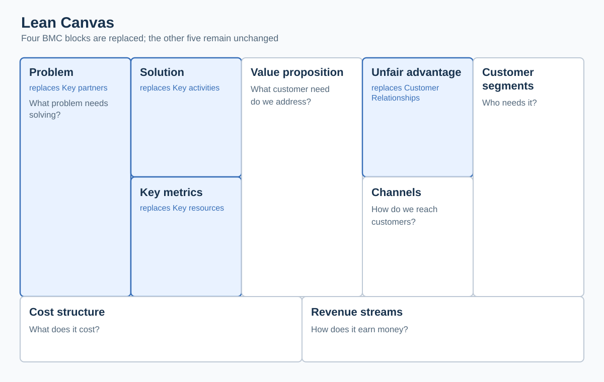

# Business Model Canvas Blocks

**Date:** 2026-09-23  
**Week:** 2

## Lesson Summary

The Business Model Canvas (BMC) describes how a proposed company could create, deliver, and capture value. Its nine blocks are initially hypotheses: customer discovery tests them against real customer needs before the team commits to a business model.

- The nine BMC blocks and the links between customer segments, value propositions, revenue, and costs
- Customer jobs, pains, gains, and product–market fit
- Customer personas, buying roles, market types, and multisided markets
- Interviews, experiments, evidence, and pivots during customer discovery
- Examples of evolving canvases and the first group assignment

---

## From an idea to a business model

**Business model** = a business model describes all the parts of the company necessary to make money

A technology idea alone does not define a company. The team must also describe a business model and assess the size of the opportunity. The **Business Model Canvas** (BMC) provides a shared structure for describing and challenging the parts of a company needed to make money.

| Block | Main question |
| --- | --- |
| **Customer segments** | Who has the problem or need, and who might buy? |
| **Value propositions** | Which customer jobs, pains, and gains does the offer address? |
| **Channels** | How will the company reach customers and deliver the offer? |
| **Customer relationships** | What kind of relationship will the company establish and maintain? |
| **Revenue streams** | How will the company earn money from each segment? |
| **Key resources** | Which assets are needed to deliver the offer? |
| **Key activities** | What must the company do? |
| **Key partners** | Which outside parties are needed? |
| **Cost structure** | What will operating the model cost? |

**VP** = Value Proposition
**CS** = Customer Segment

Relationship between VPs and CSs is **Product Market Fit**

**Key takeaway:** Customers care about solving a problem or satisfying a need, rather than the technology for its own sake.

<big>
Customers don't care about your technology.
They are trying to solve a problem or satisfy a need.
</big>

## The canvas is a set of hypotheses

Each BMC entry is a guess until supported by evidence.

The **customer development process** has four stages: customer discovery, customer validation, customer creation, and company building. The module concentrates on discovery.

In **customer discovery**, founders go outside the organisation to test those guesses.

Within **customer discovery**, the sequence is: write the canvas, extract its hypotheses, test the customer problem, test the proposed solution, then proceed or **pivot**. A pivot changes one or more BMC components in response to what is learned; it is part of the search for a workable model.

In **customer validation**, the sequence shown is: get ready to sell, sell, establish positioning, then pivot or proceed. This sales-oriented stage is beyond the time available in the module.

The lecture also introduces a **minimum viable product (MVP)** as a small feature set used to obtain learning and feedback quickly. For this module, a wireframe may be enough to communicate an idea in an interview; building a full product is not expected here.

An aside mentions the **Lean Canvas**, which replaces four BMC blocks: key partners with *problem*, key activities with *solution*, key resources with *key metrics*, and customer relationships with *unfair advantage*.

